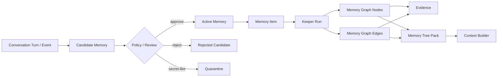

# Agent Memory Kernel

Local-first, auditable memory for AI agents.

Agent Memory Kernel is a small open-source template for giving agents a durable
memory layer without locking the project to one vendor, product, model, or
private workflow. It starts with two default memory lanes:

- `personal`: preferences, recurring personal context, communication style.
- `professional`: projects, decisions, rules, gotchas, working knowledge.

Teams can extend those lanes into project-specific graph trees, success/failure
loops, Hermes adapters, CRM memory, SEO project memory, support memory, or any
other domain-specific layer.

## Why this exists

Most agent memory is either too opaque or too thin:

- chat memory is convenient, but hard to audit, correct, export, or reuse;
- vector search is useful, but it often loses provenance and lifecycle;
- project notes are readable, but agents need structured retrieval and trust
metadata;
- full knowledge graphs are powerful, but too heavy as a first step.

This project takes a middle path: every memory starts as an event, becomes a
candidate, passes review or policy, and only then becomes active memory. Active
memory has source links, trust labels, audit history, graph nodes, and an
agent-ready context pack. When an agent needs deeper working context, the same
data can be returned as a Memory Tree Pack: short branch labels at the top,
active memories in the middle, and raw source excerpts at the bottom.

## Status

This is `v0.1.0`: a working local kernel, not a hosted product.

Included now:

- SQLite storage.
- Append-only source events.
- Candidate memory lifecycle.
- Manual review and conservative auto-approval.
- Secret-like and prompt-injection-like content quarantine.
- Active memory search.
- Agent context packs with provenance.
- Runtime hooks: `before-model-call` and `after-saved-turn`.
- Scope access enforcement for runtime memory retrieval.
- Queued Keeper jobs and `worker` processing.
- Local stdlib HTTP API service: `serve`.
- Conversation turns, thread messages, and rolling summaries.
- Compact `memory_items`.
- Persistent memory graph nodes and edges.
- Node and edge evidence.
- Keeper runs and graph commands audit.
- Graph groups and optimization runs.
- Light Model semantic analyses: facts, chronology, key topics, people, events,
  verified entities.
- Profile intro, profile rules, project profile metadata, and LLM usage stats.
- Digital Brain state: left/right counts, calibration, node hemisphere, visual
  coordinates.
- Memory Tree Packs with branches, graph nodes, relationships, and raw provenance.
- Full context builder with rules, profile, summaries, recent messages, and tree supplement.
- Deterministic vertical slice commands: `slice seed`, `slice run`, `slice assert`.
- Markdown vault export.
- CLI.
- Tests and demo commands.

Not included yet:

- hosted multi-user API server;
- web UI;
- provider embeddings;
- production LLM Keeper/extractor;
- production Hermes integration;
- multi-user auth.

## Install

From this repository:

```bash
python3 -m venv .venv
. .venv/bin/activate
pip install -e ".[dev]"
```

Or run directly during development:

```bash
PYTHONPATH=src python3 -m agent_memory_kernel.cli init
```

## Quick Start

Initialize a local database:

```bash
agent-memory init --db .memory/demo.db
```

Record a professional memory candidate:

```bash
agent-memory remember --db .memory/demo.db \
  "Rule: for SEO projects, record both successful and failed content loop attempts." \
  --scope professional
```

Review candidates:

```bash
agent-memory review --db .memory/demo.db list --status pending
```

Approve one candidate:

```bash
agent-memory review --db .memory/demo.db approve cand_xxxxxxxxxxxxxxxx
```

Search active memory:

```bash
agent-memory search --db .memory/demo.db "SEO projects"
```

Build a context pack for an agent:

```bash
agent-memory context-pack --db .memory/demo.db "planning an SEO loop"
```

Build a tree pack for an agent before planning:

```bash
agent-memory tree-pack --db .memory/demo.db "planning an SEO loop" --scope professional
```

Inspect the persistent graph tree:

```bash
agent-memory graph --db .memory/demo.db nodes --scope professional
agent-memory graph --db .memory/demo.db edges --scope professional
agent-memory graph --db .memory/demo.db groups --scope professional
agent-memory graph --db .memory/demo.db analyses --scope professional
agent-memory graph --db .memory/demo.db keeper-runs
agent-memory graph --db .memory/demo.db optimize --mode record_linkage --scope professional
```

Build the richer context that Hermes would pass to an agent:

```bash
agent-memory build-context --db .memory/demo.db "planning an SEO loop" --scope professional
```

Record profile and usage metadata:

```bash
agent-memory profile --db .memory/demo.db set-intro "This workspace works on SEO projects."
agent-memory profile --db .memory/demo.db add-rule "Always retrieve memory before planning."
agent-memory usage --db .memory/demo.db record --model gpt-4.1-mini --prompt-tokens 100 --completion-tokens 40
agent-memory export-profile --db .memory/demo.db --scope professional
agent-memory import-profile --db .memory/restored.db exported-profile.json
```

Export a readable vault:

```bash
agent-memory export --db .memory/demo.db --out memory-vault
```

## Core Model

The kernel uses a simple lifecycle:



Every active memory keeps:

- original event provenance;
- scope;
- kind;
- confidence;
- sensitivity;
- source trust;
- audit trail;
- compact memory item;
- graph nodes, graph edges, and evidence.

## Scopes

The starter scopes are intentionally simple:

- `personal`: user preferences, style, long-lived personal facts.
- `professional`: work memory, project rules, decisions, failures, success
  patterns.
- `project`: optional per-project memory.
- `agent`: agent-specific operational memory.
- `session`: short-lived session memory.

The default public template focuses on `personal` and `professional` so it is
useful for people who do not work with loops. Teams that do work with iterative
systems can add outcome-oriented layers on top.

## Memory Tree Pack

The Memory Tree Pack is the main agent-facing retrieval format for planning
work. Tags and graph nodes help the kernel route the query, but the agent gets
grounded context:

```text
Root query
  Branch: project / demo-site
    Why selected
    Active memories
    Related graph nodes
    Raw provenance excerpts
```

This keeps the top of the tree compact while still letting an agent inspect the
source conversation, session summary, decision, or tool result that created a
memory. It is designed for Hermes-style orchestration: ask for the tree before
planning, then record new events after the work.

Under the hood, approved memories now flow through a Keeper step:

```text
event -> candidate -> active memory -> memory_item
      -> memory_graph_nodes / memory_graph_edges
      -> node_evidence / edge_evidence
      -> semantic_analyses / graph_groups / digital_brain_state
      -> tree-pack / build-context
```

The starter Keeper is deterministic and dependency-free. It already writes the
same structural slots expected by a richer model-backed implementation:
entities, links, commands, normalized nodes, dedupe keys, blobs, importance, and
embedding fields. The starter Light Model also records facts, chronology, key
topics, people, events, and verified entities.

## SEO / Loop Extension

For SEO projects, the useful extension is not just "remember everything." The
high-value layer is outcome memory:

- what loop was attempted;
- what inputs were used;
- what result was measured;
- what failed;
- what succeeded;
- what rule should future agents reuse or avoid.

That extension can be implemented as a domain schema over this kernel:

```text
attempt -> outcome -> lesson -> reusable_rule
attempt -> failed_because -> gotcha
attempt -> succeeded_because -> pattern
```

See [examples/agent-loop-demo/README.md](examples/agent-loop-demo/README.md).

## Hermes Integration

Hermes should not own the memory. Hermes should call the memory kernel.

Recommended shape:

1. Before planning, Hermes asks the kernel for a Memory Tree Pack.
2. During work, Hermes records events and candidate memories.
3. After work, a reviewer or policy promotes useful candidates.
4. Future agents retrieve only the relevant memory tree instead of scanning old
   chats.

See [docs/hermes-integration.md](docs/hermes-integration.md).

Runtime hook shape:

```bash
agent-memory before-model-call "Plan the next SEO loop" \
  --thread-id seo-demo \
  --scope professional \
  --allowed-scopes professional \
  --agent-id writer \
  --model-id gpt-4.1-mini

agent-memory after-saved-turn \
  --thread-id seo-demo \
  --scope professional \
  --keeper-mode queued \
  --user-text "Plan the next SEO loop" \
  --assistant-text "Use the prior successful refresh pattern."

agent-memory worker --db .memory/demo.db --once --limit 10
```

The first command returns a provider-neutral prompt envelope with a selected
`MEMORY_TREE_SUPPLEMENT`. The second command records the exchange and creates
reviewable Keeper candidates in sync mode or queues the Keeper job in queued
mode. The worker command processes queued Keeper jobs.

## Implementation Plan

The detailed build plan is in
[docs/implementation-plan.md](docs/implementation-plan.md). It is written so a
future agent or contributor can continue from this template without needing the
original planning conversation.

The gap plan for the full automatic memory system is in
[docs/full-memory-gap-plan.md](docs/full-memory-gap-plan.md). It maps the
reference-memory findings to the missing repository layers: automatic Keeper,
Memory Router, prompt envelope, Hermes hooks, API/MCP service mode, review, and
security hardening.

The full-memory work is split into hard contracts so contributors can implement
it without relying on the original planning conversation:

- [docs/runtime-contract.md](docs/runtime-contract.md) defines the live
  `before_model_call` / `after_saved_turn` loop.
- [docs/memory-lifecycle-contract.md](docs/memory-lifecycle-contract.md)
  defines create, correct, delete, distrust, expire, conflict, and export
  behavior.
- [docs/cross-model-context-contract.md](docs/cross-model-context-contract.md)
  defines the provider-neutral prompt envelope and Memory Tree Supplement.
- [docs/security-identity-contract.md](docs/security-identity-contract.md)
  defines identity, permissions, trust, audit, and leakage controls.
- [docs/end-to-end-vertical-slice.md](docs/end-to-end-vertical-slice.md)
  defines the first executable full-memory scenario.

## Safety Model

The kernel is intentionally conservative:

- raw events are stored locally;
- active memory is separated from candidate memory;
- secret-like values are quarantined;
- every active memory has provenance;
- untrusted sources stay pending by default;
- correction, soft-delete, distrust, and expiration are first-class operations.

This is important because agent memory can otherwise become a prompt-injection
and data-leak surface.

## Development

Run tests:

```bash
PYTHONPATH=src python3 -m unittest discover -s tests
```

Run a CLI smoke test:

```bash
PYTHONPATH=src python3 -m agent_memory_kernel.cli init --db /tmp/amk-demo.db
```

## Project Layout

```text
src/agent_memory_kernel/
  cli.py                 CLI commands
  store.py               SQLite-backed memory store
  policy.py              safety and admission policy
  server.py              stdlib HTTP API service
  schema.sql             database schema
  slice.py               deterministic full-memory vertical slice fixture
  extractors/            deterministic v0 extractor and extension seams
docs/
  implementation-plan.md  phased build plan
  full-memory-gap-plan.md  gap plan for automatic full memory
  runtime-contract.md      pre-call router and post-turn keeper contract
  memory-lifecycle-contract.md  durable memory lifecycle contract
  cross-model-context-contract.md  provider-neutral prompt context contract
  security-identity-contract.md  identity, permissions, and trust contract
  end-to-end-vertical-slice.md  first full-memory acceptance scenario
  memory-tree-pack.md     tree-shaped retrieval format
  v0-memory-contract.md  lifecycle and data contract
  hermes-integration.md  adapter architecture
  roadmap.md             next milestones
examples/
  personal-professional-demo/
  agent-loop-demo/
templates/
  vault/
tests/
```

## License

MIT.
