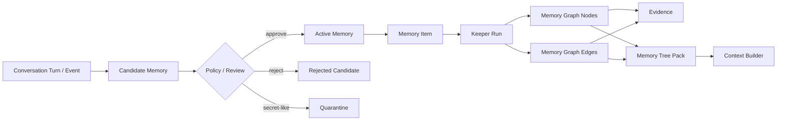

# Agent Memory Kernel

Local-first, auditable memory for AI agents.

Agent Memory Kernel is a small open-source template for giving agents and
human workflows a durable memory layer without locking the project to one
vendor, product, model, or private workflow. The core primitive is generic
scope/lane/namespace policy isolation. The starter templates include two
default lanes:

- `personal`: preferences, recurring personal context, communication style.
- `professional`: projects, decisions, rules, gotchas, working knowledge.

Teams can define additional scopes, namespaces, policy packs, and renderers for
project-specific graph trees, success/failure loops, runtime adapters, CRM
memory, SEO project memory, support memory, or any other domain-specific layer.
Bundled templates and adapter examples are optional, not a requirement of the
kernel.

The project boundary is defined in
[docs/kernel-charter.md](docs/kernel-charter.md) and
[docs/amk-000-kernel-invariants.md](docs/amk-000-kernel-invariants.md): the
kernel owns local memory truth, lifecycle, policies, retrieval, prompt
envelopes, provenance, portability, and conformance. Runtime adapters, domain
packs, hosted services, vector search, Memory Tree renderers, and provider
integrations are optional extensions.

## Why this exists

Most agent memory is either too opaque or too thin:

- chat memory is convenient, but hard to audit, correct, export, or reuse;
- vector search is useful, but it often loses provenance and lifecycle;
- project notes are readable, but agents need structured retrieval and trust
metadata;
- full knowledge graphs are powerful, but too heavy as a first step.

This project takes a middle path: every memory starts as an event, becomes a
candidate, passes review or policy, and only then becomes active memory. Active
memory has source links, trust labels, audit history, graph nodes, and an
agent-ready prompt envelope. When an agent needs deeper working context, the
same selected data can be returned as a Memory Tree Pack: short branch labels
at the top, active memories in the middle, and raw source excerpts at the
bottom.

## Status

This is `v0.1.0`: a working local kernel, not a hosted product.

Included now:

- SQLite storage.
- Append-only source events.
- Candidate memory lifecycle.
- Manual review and conservative auto-approval.
- Secret-like and prompt-injection-like content quarantine.
- Active memory search.
- Agent context packs with provenance.
- Runtime hooks: `before-model-call` and `after-saved-turn`.
- High-level `MemoryOrchestrator` service facade for `before_turn`,
  `build_prompt_context`, `retrieve_context`, `record_turn`,
  `keeper_analyze_turn`, `ingest_graph`, and `after_turn`.
- Formal machine-readable Memory Contract and acceptance harness.
- Versioned public conformance scenarios for adapter compatibility.
- Compact public adapter registry entry generation from conformance
  certification.
- Scope access enforcement for runtime memory retrieval.
- Agent write-policy enforcement for record, auto-approve, review, lifecycle,
  outcome, conflict, and supersession paths.
- Capability/consent reports for read, inject, export, promote, lifecycle, and
  other write actions.
- Identity delegation report for hosted/team adapters with tenant id, explicit
  policies, implicit local allows, wildcard risk, and recommended policy
  commands.
- Correction revision history and rollback for active memories.
- Derived-memory invalidation ledger for correction, rollback, delete,
  distrust, expire, and supersede lifecycle actions.
- Operational status checks and no-memory/failed-Keeper fallbacks for local
  runtime failures.
- Kernel status report for local API, contract, schema, bundle, conformance,
  lifecycle, policy, migration, and compatibility versions.
- SQLite migration status, migration changelog, backup/restore commands, and
  local restore-drill schedules for recovery supervision.
- Conflict and supersession records for truth maintenance.
- Current-best conflict resolution for prompt-facing tree retrieval.
- First-class outcome records for success/failure loop memory.
- Queued Keeper jobs and `worker` processing.
- Local stdlib HTTP API service with browser review/graph pages and optional
  bearer-token guard: `serve`.
- Dependency-free stdio MCP server: `mcp` / `agent-memory-mcp`.
- Conversation turns, thread messages, and rolling summaries.
- Compact `memory_items`.
- Persistent memory graph nodes and edges.
- Node and edge evidence.
- Keeper runs, graph command normalization, and graph command audit.
- Graph groups and optimization runs.
- Light Model semantic analyses: facts, chronology, key topics, people, events,
  verified entities.
- Versioned LLM Keeper extraction contract through `LLMKeeperExtractor` for
  low-cost model memory writes without requiring a live provider in tests.
- OpenAI-compatible lightweight extractor adapter with deterministic fallback
  for contract tests and local operation.
- Offline Keeper extraction eval harness: `keeper-eval`, `/keeper-eval/run`,
  MCP `memory_keeper_eval`, and thin runtime adapter wrappers.
- Profile intro, profile rules, project profile metadata, and LLM usage stats.
- Combined Router/Keeper/usage observability report with token, cost,
  wall-clock duration, and local latency SLO alert telemetry.
- Operations dashboard that aggregates operational health, observability,
  billing, worker, recovery schedules, and notifications into one report.
- Billing reconciliation report for recorded memory LLM usage, provider/model
  cost grouping, imported provider invoice line items, expected-cost deltas,
  and suspicious usage rows.
- Prompt-budget adapter for model-family memory budgets across OpenAI, Claude,
  Gemini, and local model families.
- Provider prompt formatters for OpenAI, Anthropic, Google/Gemini, and local
  runtimes through `before-model-call --prompt-format`.
- Operator review inbox with source previews, risk flags, inline
  possible-conflict warnings, graph previews, audit trail, and CLI/HTTP/MCP
  action handles.
- Browser review UI at `/ui/review` with single and batch approve/reject,
  correction preview/apply for active memories, conflict scan UI at
  `/ui/conflicts`, and graph browser UI at `/ui/graph` with node/edge
  navigation and source metadata.
- Batch review for approve/reject with dry-run and per-candidate results.
- Batch lifecycle correction for active memories with dry-run and per-item
  results.
- Graph browser data API with nodes, edges, and source previews.
- Operator notification queue, reviewer assignment, SLA status filtering, and
  escalation reports plus webhook/email/push payload builders for review
  candidates, export approvals, and expired export artifacts.
- Notification delivery outbox for queuing transport payloads and tracking
  delivered/failed status from external senders.
- Worker supervision status for queued Keeper jobs, stale queue alerts, failed
  job alerts, and operator run/inspect commands.
- Digital Brain state: left/right counts, calibration, node hemisphere, visual
  coordinates.
- Guarded Digital Brain style append in provider-neutral prompt envelopes.
- Brain/style certification for guarded prompt behavior across CLI, HTTP, and
  MCP surfaces.
- Memory Tree Packs with branches, graph nodes, relationships, and raw provenance.
- Router read-time policy, explainability, usefulness feedback, and memory
  quality reports.
- Dependency-free semantic reranking for Memory Tree retrieval.
- Provider-neutral embedding contract with local deterministic fallback and
  optional provider rerank hook for larger corpora.
- OpenAI-compatible embedding provider adapter for hosted vectors without a
  hard SDK dependency.
- Embedding/rerank contract certification for deterministic local fallback and
  optional provider adapter checks.
- Full context builder with rules, profile, summaries, recent messages, and tree supplement.
- Runtime/Python production turn wrapper: `run_agent_turn()` builds the prompt
  envelope, calls a supplied main agent, saves the exchange, and runs Keeper.
- Deterministic vertical slice commands: `slice seed`, `slice run`, `slice assert`.
- Export control previews with policy decisions, scope counts, and aggregate
  risk flags before memory leaves the store.
- Export redaction profiles for JSON profile and Markdown vault exports:
  `full`, `safe`, and `metadata`.
- Sensitive full-export approval requests for personal or secret active memory.
- Export retention ledger with expiry, purge status, and Markdown export
  manifests.
- Portable `.amk` profile bundle export/import with manifest checksum:
  `amk-bundle-v0.1`.
- Encrypted profile export/import envelopes with passphrase-derived keys:
  `encrypted-export-v0.1`.
- Export custody reports that verify export policy, sensitive approval,
  passphrase configuration, off-host artifact custody, and zero secret storage
  in the memory database.
- Markdown vault export.
- File-based machine-readable markdown vault adapter with export/import through
  normal review lifecycle.
- CLI.
- Tests and demo commands.

Not included yet:

- hosted multi-user API server;
- hosted multi-user web UI beyond the local browser review/graph pages;
- approximate-nearest-neighbor indexes and live embedding provider certification;
- live production Keeper traces, prompt tuning, and managed model configuration;
- rollout into live agent runtime profiles and traffic shadow review;
- hosted multi-user auth/RBAC beyond the local bearer-token guard.

## Install

From this repository:

```bash
python3 -m venv .venv
. .venv/bin/activate
pip install -e ".[dev]"
```

Or run directly during development:

```bash
PYTHONPATH=src python3 -m agent_memory_kernel.cli init
```

## Quick Start

Initialize a local database:

```bash
agent-memory init --db .memory/demo.db
```

Record a professional memory candidate:

```bash
agent-memory remember --db .memory/demo.db \
  "Rule: for SEO projects, record both successful and failed content loop attempts." \
  --scope professional
```

Review candidates:

```bash
agent-memory review --db .memory/demo.db list --status pending
agent-memory review --db .memory/demo.db inbox --status open --scope professional
agent-memory review --db .memory/demo.db batch approve cand_a cand_b --dry-run
```

Approve one candidate:

```bash
agent-memory review --db .memory/demo.db approve cand_xxxxxxxxxxxxxxxx
```

Search active memory:

```bash
agent-memory search --db .memory/demo.db "SEO projects"
```

Mark memory truth changes explicitly:

```bash
agent-memory conflict --db .memory/demo.db detect --scope professional --kind decision
agent-memory conflict --db .memory/demo.db record mem_old mem_new --reason "newer project rule conflicts"
agent-memory supersede --db .memory/demo.db mem_old mem_new --reason "newer user-stated memory wins"
agent-memory conflict --db .memory/demo.db list --status resolved
agent-memory current-best --db .memory/demo.db --scope professional "project rule"
```

`conflict detect` reports likely active-memory conflicts and can record open
conflict records with `--record`.
`supersede` suppresses the old memory from retrieval and graph export while
recording a resolved conflict relationship for audit.
`current-best` shows how prompt-facing retrieval resolves explicit conflicts
and near-duplicate memory: resolved winners suppress loser memories, strongly
overlapping active memories can be ranked by trust/confidence/recency/evidence,
and open conflicts stay visible as unresolved review items.

Correct and rollback memory:

```bash
agent-memory correct --db .memory/demo.db mem_xxxxxxxxxxxxxxxx \
  "Decision: demo-site target market is B2B SaaS." \
  --reason "user corrected target market"

agent-memory revisions --db .memory/demo.db mem_xxxxxxxxxxxxxxxx
agent-memory rollback --db .memory/demo.db mem_xxxxxxxxxxxxxxxx \
  --revision-id revn_xxxxxxxxxxxxxxxx \
  --reason "restore previous wording"
```

Corrections store before/after text in `memory_revisions`. Rollback restores
the prior text, propagates the change to memory items and graph summaries, and
records a new rollback revision plus audit event.

Record a loop outcome:

```bash
agent-memory outcome --db .memory/demo.db record \
  --project demo-site \
  --status success \
  --action "Updated search intent and internal links." \
  --result "Organic clicks improved after publishing." \
  --lesson "Refresh intent and internal links together." \
  --next-recommendation "Reuse this pattern on similar pages." \
  --approve

agent-memory outcome --db .memory/demo.db pack --project demo-site
agent-memory outcome --db .memory/demo.db compare --project demo-site
```

Outcome records keep structured attempt/result/cause/lesson fields and can also
create normal memory candidates, so they remain reviewable and provenance-backed.

Build a context pack for an agent:

```bash
agent-memory context-pack --db .memory/demo.db "planning an SEO loop"
```

Build a tree pack for an agent before planning:

```bash
agent-memory tree-pack --db .memory/demo.db "planning an SEO loop" --scope professional
```

Inspect the persistent graph tree:

```bash
agent-memory graph --db .memory/demo.db nodes --scope professional
agent-memory graph --db .memory/demo.db edges --scope professional
agent-memory graph --db .memory/demo.db groups --scope professional
agent-memory graph --db .memory/demo.db analyses --scope professional
agent-memory graph --db .memory/demo.db keeper-runs
agent-memory graph --db .memory/demo.db brain-style --scope professional
agent-memory brain-style-certify --db .memory/demo.db --scope professional
agent-memory graph --db .memory/demo.db optimize --mode record_linkage --scope professional
```

Build the richer context that any runtime adapter would pass to an agent:

```bash
agent-memory build-context --db .memory/demo.db "planning an SEO loop" --scope professional
```

Runtime prompt envelopes can suppress graph-derived style hints when an
orchestrator policy wants memory content but not style influence:

```bash
agent-memory before-model-call --db .memory/demo.db "planning an SEO loop" \
  --scope professional \
  --disable-brain-style
```

Inspect why the Router selected memory for a prompt:

```bash
agent-memory read-time-policy --db .memory/demo.db --scope professional
agent-memory router-runs --db .memory/demo.db --thread-id seo-demo
agent-memory router-explain --db .memory/demo.db router_xxxxxxxxxxxxxxxx
```

Inspect what changed after a saved turn:

```bash
agent-memory after-saved-turn --db .memory/demo.db \
  --thread-id seo-demo \
  --scope professional \
  --user-text "Plan the next SEO loop." \
  --assistant-text "Reuse the prior successful refresh pattern."

agent-memory memory-changes --db .memory/demo.db --keeper-job-id kjob_xxxxxxxxxxxxxxxx
agent-memory memory-changes --db .memory/demo.db --thread-id seo-demo
```

`memory-changes` explains the saved turns, Keeper event, candidate memories,
promoted active memories, affected graph/context surfaces, review or lifecycle
handles, and audit trail for a post-turn memory update.

For a consolidated operator queue, use `review inbox`. It includes source
event excerpts, Keeper extraction preview, risk flags, inline
possible-conflict warnings against active memory, review history, audit trail,
and ready-to-call CLI/HTTP/MCP handles for approve, reject, correct, delete,
distrust, or expire. Use `review batch` to approve or reject multiple candidates
with one per-candidate result and optional `--dry-run`.

Record whether selected memory helped and inspect quality signals:

```bash
agent-memory router-feedback --db .memory/demo.db record router_xxxxxxxxxxxxxxxx \
  --memory-id mem_xxxxxxxxxxxxxxxx \
  --rating helpful \
  --reason "grounded the plan"

agent-memory router-feedback --db .memory/demo.db list --router-run-id router_xxxxxxxxxxxxxxxx
agent-memory memory-quality --db .memory/demo.db --scope professional
agent-memory observability --db .memory/demo.db --scope professional
agent-memory dashboard --db .memory/demo.db --scope professional --summary-only
agent-memory billing-invoice --db .memory/demo.db import --file provider-invoice.json
agent-memory billing-reconcile --db .memory/demo.db --scope professional --expected-cost 0.25 --tolerance 0.01
agent-memory prompt-budget --db .memory/demo.db --model-id llama-3.1-8b --token-budget 12000
agent-memory current-best --db .memory/demo.db --scope professional "planning an SEO loop"
agent-memory graph --db .memory/demo.db optimize --mode consolidate_duplicates --scope professional
agent-memory graph --db .memory/demo.db optimize --mode decay_stale --scope professional
```

`memory-quality` returns a versioned quality contract report. It combines
Router feedback coverage, helpful/harmful feedback, shadow trace eval pass
rate, recent failed golden fixtures, Keeper job health, and pass/fail/evidence
gates so rollout reviews can distinguish healthy, under-evaluated, and failing
memory behavior.

Inspect the formal memory contract and run the deterministic full-memory gate:

```bash
agent-memory contract
agent-memory contract assert
agent-memory acceptance seed --db .memory/acceptance.db
agent-memory acceptance assert --db .memory/acceptance.db
agent-memory conformance spec
agent-memory conformance seed --db .memory/conformance.db
agent-memory conformance assert --db .memory/conformance.db
agent-memory conformance certify --db .memory/conformance.db --adapter-name my-runtime
agent-memory conformance registry-entry --db .memory/conformance.db --adapter-name my-runtime
agent-memory prompt-format-certify --db .memory/conformance.db --providers openai,anthropic,gemini,local
agent-memory embedding-certify --db .memory/conformance.db --provider local --dims 32
```

The acceptance harness checks the minimum closed-loop behavior: selected memory
beats a no-memory baseline, personal memory does not leak into professional
prompts, unsafe memory is absent, source ids are logged, correction/rollback
affect retrieval, Keeper writes stay reviewable, and write policy blocks
unauthorized promotion.

The conformance suite is the public compatibility layer. It checks named
scenarios for professional memory injection, stored read-policy denial,
personal-lane isolation, resolved conflict suppression, deleted-memory absence,
unsafe-memory absence, reviewable/idempotent Keeper writes, and golden traces
for outcome planning, graph evidence inspection, safe profile export, lifecycle
tombstone export/import, migration compatibility, and security red-team cases
for secrets, tool output, assistant guesses, and personal export
approval/redaction.
Adapters can use it as the first "does this behave like Agent Memory Kernel?"
gate. `conformance certify` wraps the same suite in an adapter certification
report with pass/fail status, scenario counts, golden trace coverage, and a
local badge URL/Markdown snippet suitable for README or CI output.
`conformance registry-entry` emits a compact `registry/adapters/<id>.json`
payload with adapter metadata, badge, certification summary, and publication
readiness for a public adapter catalog.
`prompt-format-certify` separately checks provider prompt shapes and proves the
memory supplement, hostile memory text, tool output, assistant guesses, and
secret-like fixture text remain user-context instead of becoming hidden system
text.

Record profile and usage metadata:

```bash
agent-memory profile --db .memory/demo.db set-intro "This workspace works on SEO projects."
agent-memory profile --db .memory/demo.db add-rule "Always retrieve memory before planning."
agent-memory usage --db .memory/demo.db record --model gpt-4.1-mini --prompt-tokens 100 --completion-tokens 40
agent-memory observability --db .memory/demo.db --thread-id seo-demo
agent-memory billing-invoice --db .memory/demo.db list --provider openai
agent-memory billing-reconcile --db .memory/demo.db --thread-id seo-demo --max-cost-per-1k 0.05
agent-memory migration-status --db .memory/demo.db
agent-memory migration-changelog --db .memory/demo.db
agent-memory backup --db .memory/demo.db --out .memory/backups/demo-backup.db
agent-memory restore --backup .memory/backups/demo-backup.db --target-db .memory/restored.db
agent-memory restore-drill --db .memory/demo.db --scope professional --probe-query "SEO projects"
agent-memory restore-drill-schedule --db .memory/demo.db set --name nightly --interval-hours 24 --scope professional --probe-query "SEO projects"
agent-memory restore-drill-schedule --db .memory/demo.db run-due --limit 5
agent-memory export-control --db .memory/demo.db --scope professional --actor writer --redaction-profile safe
agent-memory export-custody --db .memory/demo.db --scope professional --actor writer --redaction-profile safe --artifact-ref s3://memory-exports/demo/exported-profile.encrypted.json
agent-memory export-profile --db .memory/demo.db --scope professional --redaction-profile safe
AGENT_MEMORY_EXPORT_PASSPHRASE="change-me" agent-memory export-encrypted-profile --db .memory/demo.db --out exported-profile.encrypted.json --scope professional --redaction-profile safe
AGENT_MEMORY_EXPORT_PASSPHRASE="change-me" agent-memory import-encrypted-profile --db .memory/restored.db exported-profile.encrypted.json
agent-memory import-profile --db .memory/restored.db exported-profile.json
```

Configure agent write authority:

```bash
agent-memory write-policy --db .memory/demo.db set \
  --agent-id writer \
  --scope professional \
  --action auto_approve \
  --decision deny \
  --reason "writer proposes memory; reviewer approves"

agent-memory write-policy --db .memory/demo.db list --agent-id writer
```

When `auto_approve` is denied, raw events are still stored but durable active
memory stays as a review candidate. Destructive or lifecycle actions such as
`approve`, `correct`, `delete`, `distrust`, `expire`, `conflict`, and
`supersede` are blocked with an audited `write_denied` event when policy denies
them.

Configure agent read/injection authority:

```bash
agent-memory read-policy --db .memory/demo.db set \
  --agent-id writer \
  --scope personal \
  --action inject \
  --decision deny \
  --reason "writer cannot inject personal memory"

agent-memory read-policy --db .memory/demo.db list --agent-id writer
```

When `inject` is denied, `before-model-call` returns a no-memory envelope for
that scope, logs a `read_denied` audit event, and records the matched policy in
prompt metadata.

Check the effective capability matrix before delegating work to an agent:

```bash
agent-memory capability --db .memory/demo.db \
  --actor writer \
  --scope professional
```

The report shows read actions (`read`, `inject`, `export`) and write actions
(`record`, `approve`, `delete`, `distrust`, `supersede`, and others) with the
matched policy, reason, and denied actions. Direct `search`, `context-pack`,
`graph tree`, and profile/markdown export calls can take `--actor` so denied
read/export policies are enforced outside the prompt hook too.
Use `export-control` before `export-profile` or markdown export to see whether
the actor can export the requested scope, what aggregate memory counts are in
scope, and whether personal, secret, or denied-scope risk flags are present.
Use `export-custody` before encrypted/off-host exports to verify the same policy
decision plus key custody requirements: the passphrase comes from an environment
variable, no passphrase or derived key is stored in SQLite, and production
exports can require an external artifact reference such as object storage,
vault, or backup ID.
Use `--redaction-profile safe` or `--redaction-profile metadata` when the
export should preserve structure while replacing memory content-bearing fields
with explicit redaction markers. `full` is the default and includes content.
Profile exports include a `memory_lifecycle` section so inactive memory remains
auditable as tombstones, revisions, derived invalidations, and audit events
without re-entering the active memory tree.
They also include a `memory_policy_state` section with applicable read/write
policies and policy audit events, so imported stores keep the same deny/allow
decisions instead of silently widening access.
Full profile imports restore lifecycle rows, source events, candidates, memory
items, source references, review actions, revisions, invalidations, and audit
records plus read/write policy state while keeping deleted or distrusted memory
out of retrieval.
When a `full` export includes personal or secret active memory, request and
approve a one-time export approval before passing `--approval-id`.

```bash
agent-memory export-control --db .memory/demo.db \
  --actor writer \
  --scope professional \
  --redaction-profile safe

agent-memory export-custody --db .memory/demo.db \
  --actor writer \
  --scope professional \
  --redaction-profile safe \
  --artifact-ref s3://memory-exports/demo/exported-profile.encrypted.json

agent-memory export-profile --db .memory/demo.db \
  --scope professional \
  --redaction-profile safe

agent-memory export-bundle --db .memory/demo.db \
  --out workspace-memory.amk.json \
  --scope professional \
  --redaction-profile safe

agent-memory verify-bundle --db .memory/demo.db workspace-memory.amk.json

agent-memory import-bundle --db .memory/restored.db workspace-memory.amk.json

agent-memory export --db .memory/demo.db \
  --out memory-vault \
  --redaction-profile safe \
  --retention-days 30

agent-memory export-approval --db .memory/demo.db request \
  --actor writer \
  --scope personal \
  --export-kind profile \
  --reason "user requested a full portable export"

agent-memory export-approval --db .memory/demo.db approve xapr_xxxxxxxxxxxxxxxx \
  --actor reviewer \
  --reason "explicit user request"

agent-memory export-profile --db .memory/demo.db \
  --actor writer \
  --scope personal \
  --approval-id xapr_xxxxxxxxxxxxxxxx

AGENT_MEMORY_EXPORT_PASSPHRASE="change-me" agent-memory export-encrypted-profile \
  --db .memory/demo.db \
  --out exported-profile.encrypted.json \
  --scope professional \
  --redaction-profile safe

AGENT_MEMORY_EXPORT_PASSPHRASE="change-me" agent-memory import-encrypted-profile \
  --db .memory/restored.db \
  exported-profile.encrypted.json

agent-memory export-retention --db .memory/demo.db list --status active
agent-memory export-retention --db .memory/demo.db enforce --actor janitor
```

Portable `.amk` bundles wrap the same governed/redacted profile payload in an
`amk-bundle-v0.1` manifest with schema version, AMK contract marker,
lifecycle/policy versions, and a canonical JSON SHA-256 payload checksum.

Encrypted profile exports wrap the same governed/redacted profile payload in an
authenticated `encrypted-export-v0.1` envelope. CLI commands can read the
passphrase from `AGENT_MEMORY_EXPORT_PASSPHRASE` or `--passphrase-file`.
The passphrase is intentionally treated as runtime custody, not memory data:
`export-custody` reports whether the configured environment variable exists and
whether an off-host artifact reference was supplied, but it never returns or
stores key material.

Inspect derived-memory invalidation after corrections or lifecycle changes:

```bash
agent-memory derived-invalidations --db .memory/demo.db --scope professional
agent-memory derived-invalidations --db .memory/demo.db --memory-id mem_xxxxxxxxxxxxxxxx
agent-memory derived-lineage --db .memory/demo.db --memory-id mem_xxxxxxxxxxxxxxxx
```

The report shows which graph, evidence, prompt-pack, export, and graph-derived
style surfaces were refreshed or invalidated so stale memory cannot silently
survive in derived context. `derived-lineage` expands the same audit trail into
source, item, graph-node, graph-edge, outcome, audit, and surface coverage so
operators can see what depends on one memory.

Use a model-backed extractor from an application:

```python
from agent_memory_kernel import MemoryStore
from agent_memory_kernel.extractors import LLMKeeperExtractor


def cheap_model_complete(request: dict):
    return provider.responses.create(**request)

store = MemoryStore(
    ".memory/demo.db",
    extractor=LLMKeeperExtractor(cheap_model_complete, model="cheap-memory-model"),
)
```

For OpenAI-compatible clients that should be passed directly, see
`OpenAIExtractor`. The versioned Keeper contract itself is documented in
[docs/keeper-extraction.md](docs/keeper-extraction.md).

Export a readable vault:

```bash
agent-memory export --db .memory/demo.db --out memory-vault
```

Export and import a machine-readable vault:

```bash
agent-memory vault --db .memory/demo.db export --out agent-memory-vault --scope professional
agent-memory vault --db .memory/restored.db import agent-memory-vault --auto-approve
```

## Core Model

The kernel uses a simple lifecycle:



Every active memory keeps:

- original event provenance;
- scope;
- kind;
- confidence;
- sensitivity;
- source trust;
- audit trail;
- compact memory item;
- graph nodes, graph edges, and evidence.

## Scopes

The starter scopes are intentionally simple:

- `personal`: user preferences, style, long-lived personal facts.
- `professional`: work memory, project rules, decisions, failures, success
  patterns.
- `project`: optional per-project memory.
- `agent`: agent-specific operational memory.
- `session`: short-lived session memory.

The default public template focuses on `personal` and `professional` so it is
useful for people who do not work with loops. Teams that do work with iterative
systems can add outcome-oriented layers on top.

## Memory Tree Pack

The Memory Tree Pack is the main agent-facing retrieval format for planning
work. Tags and graph nodes help the kernel route the query, but the agent gets
grounded context:

```text
Root query
  Branch: project / demo-site
    Why selected
    Active memories
    Related graph nodes
    Raw provenance excerpts
```

This keeps the top of the tree compact while still letting an agent inspect the
source conversation, session summary, decision, or tool result that created a
memory. It is designed for runtime-adapter orchestration: ask for the tree
before planning, then record new events after the work.

Under the hood, approved memories now flow through a Keeper step:

```text
event -> candidate -> active memory -> memory_item
      -> memory_graph_nodes / memory_graph_edges
      -> node_evidence / edge_evidence
      -> semantic_analyses / graph_groups / digital_brain_state
      -> tree-pack / build-context
```

The starter Keeper is deterministic and dependency-free. It already writes the
same structural slots expected by a richer model-backed implementation:
entities, links, commands, normalized nodes, dedupe keys, blobs, importance, and
embedding fields. The starter Light Model also records facts, chronology, key
topics, people, events, and verified entities.

## SEO / Loop Extension

For SEO projects, the useful extension is not just "remember everything." The
high-value layer is outcome memory:

- what loop was attempted;
- what inputs were used;
- what result was measured;
- what failed;
- what succeeded;
- what rule should future agents reuse or avoid.

That extension can be implemented as a domain schema over this kernel:

```text
attempt -> outcome -> lesson -> reusable_rule
attempt -> failed_because -> gotcha
attempt -> succeeded_because -> pattern
```

The starter implementation exposes this as
`agent-memory outcome record/list/pack/compare` and `/outcome/record`,
`/outcome/list`, `/outcome/pack`, `/outcome/compare`. The comparison report
extracts reusable `reuse` lessons, failure `avoid` lessons, score summaries,
contrasting success/failure causes, and recommended next actions.

See [examples/agent-loop-demo/README.md](examples/agent-loop-demo/README.md).

## Runtime Adapter Integration

The agent runtime should not own the memory. It should call the memory kernel.

Recommended shape:

1. Before planning, the runtime asks the kernel for a Memory Tree Pack.
2. During work, the runtime records events and candidate memories.
3. After work, a reviewer or policy promotes useful candidates.
4. Future agents retrieve only the relevant memory tree instead of scanning old
   chats.

See [docs/production-rollout.md](docs/production-rollout.md) for the generic
runtime rollout playbook. Adapter-specific examples, including Hermes, live in
their own docs and examples instead of defining the kernel.

For a provider-neutral executable loop, run:

```bash
agent-memory slice seed --db .memory/reference-loop.db
agent-memory slice run --db .memory/reference-loop.db
agent-memory slice assert --db .memory/reference-loop.db
```

The slice proves Router -> prompt envelope -> Keeper -> graph update behavior
with corrected memory, deleted memory, personal/professional lane separation,
prompt-injection quarantine, and real success/failure outcome records. See
[examples/reference-loop-demo/README.md](examples/reference-loop-demo/README.md).

For direct Python integration, wrap the main agent call:

```python
from agent_memory_kernel import MemoryOrchestrator

memory = MemoryOrchestrator.from_path(".memory/runtime-memory.db")

result = memory.run_agent_turn(
    "Plan the next SEO loop",
    lambda prompt: {"assistant_text": priority_model.chat(prompt["messages"]).text},
    thread_id="seo-demo",
    scope="professional",
    agent_id="writer",
)
```

This calls Router first, gives the main agent the prepared prompt envelope,
saves the exchange, runs or queues Keeper, and returns Router/Keeper audit IDs.

Runtime hook shape:

```bash
agent-memory before-model-call "Plan the next SEO loop" \
  --thread-id seo-demo \
  --scope professional \
  --allowed-scopes professional \
  --agent-id writer \
  --model-id gpt-4.1-mini

agent-memory after-saved-turn \
  --thread-id seo-demo \
  --scope professional \
  --keeper-mode queued \
  --user-text "Plan the next SEO loop" \
  --assistant-text "Use the prior successful refresh pattern."

agent-memory write-policy set \
  --agent-id writer \
  --scope professional \
  --action auto_approve \
  --decision deny \
  --reason "production writers propose memory for review"

agent-memory worker --db .memory/demo.db --once --limit 10

agent-memory worker --db .memory/demo.db --daemon --poll-interval 5 --limit 10

agent-memory shadow-turn "Plan the next SEO loop" \
  --thread-id seo-demo \
  --scope professional \
  --user-text "Plan the next SEO loop" \
  --assistant-text "Use the prior successful refresh pattern."

agent-memory shadow-traces --thread-id seo-demo

agent-memory shadow-eval trace_xxxxxxxxxxxxxxxx \
  --expected-json '{"expected_branch_labels":["seo-demo"],"require_candidates":true}'

agent-memory shadow-evals --shadow-trace-id trace_xxxxxxxxxxxxxxxx
```

The first command returns a provider-neutral prompt envelope with a selected
`MEMORY_TREE_SUPPLEMENT`. The second command records the exchange and creates
reviewable Keeper candidates in sync mode or queues the Keeper job in queued
mode. The worker command processes queued Keeper jobs.
Use `--daemon` for a long-running polling worker under a process supervisor;
`--max-iterations` and `--stop-when-idle` are available for bounded test or
maintenance runs.

For an adapter-specific CLI walkthrough of the full policy/review loop, see
[examples/hermes-e2e-demo/README.md](examples/hermes-e2e-demo/README.md).

Use `shadow-turn` before a production rollout. It links one Router run and one
Keeper job into a reviewable trace with `write_policy=propose_only`: turns and
candidate memories are recorded, but nothing is auto-approved into active
memory. Reviewing the first traces is the fastest way to build Router/Keeper
eval fixtures. `shadow-eval` stores repeatable quality checks for a trace:
expected or forbidden branch labels, candidate text, source IDs, token budget,
and whether Keeper candidates were expected.

Run the stdio MCP server when an external agent supports MCP tools:

```bash
agent-memory mcp --db .memory/demo.db
# or
agent-memory-mcp --db .memory/demo.db
```

The MCP server exposes the same orchestrator surface as the HTTP API, including
`memory_before_model_call`, `memory_before_turn`,
`memory_build_prompt_context`, `memory_after_saved_turn`, `memory_after_turn`,
`memory_retrieve_context`, `memory_ingest_graph`, `memory_changes`,
`memory_search`, `memory_tree_pack`, `memory_brain_style_certify`,
`memory_review_list`,
`memory_review_inbox`, `memory_review_batch`, `memory_review_approve`, `memory_review_reject`,
`memory_notifications_list`, `memory_notification_assign`, `memory_notification_ack`,
`memory_notification_resolve`, `memory_notification_escalations`,
`memory_keeper_eval`,
`memory_correct`, `memory_lifecycle_batch`, `memory_delete`, `memory_distrust`,
`memory_expire`, `memory_graph_browser`,
`memory_export_control`, `memory_export_profile`,
`memory_export_custody`, `memory_export_encrypted_profile`,
`memory_import_encrypted_profile`,
`memory_vault_export`, `memory_vault_import`,
`memory_export_approval_request`, `memory_export_approval_list`,
`memory_export_approval_approve`, `memory_export_approval_reject`,
`memory_export_retention_list`, `memory_export_retention_enforce`,
`memory_export_retention_purge`,
`memory_capability_check`, `memory_derived_invalidations`,
`memory_derived_lineage`,
`memory_operational_status`, `memory_observability`,
`memory_operations_dashboard`,
`memory_billing_reconcile`, `memory_billing_invoice_import`,
`memory_billing_invoice_list`,
`memory_notification_delivery_enqueue`, `memory_notification_delivery_list`,
`memory_notification_delivery_mark`,
`memory_embedding_certify`,
`memory_migration_status`, `memory_migration_changelog`, `memory_backup_database`,
`memory_restore_database`, `memory_restore_drill`,
`memory_restore_drill_schedule_set`, `memory_restore_drill_schedules`,
`memory_restore_drill_schedule_run_due`, `memory_graph_nodes`, `memory_graph_edges`, and
`memory_worker_run`, `memory_worker_status`.

## Implementation Plan

The detailed build plan is in
[docs/implementation-plan.md](docs/implementation-plan.md). It is written so a
future agent or contributor can continue from this template without needing the
original planning conversation. The plan is governed by
[docs/kernel-charter.md](docs/kernel-charter.md) and the
[docs/backlog-cutover.md](docs/backlog-cutover.md) classification:

- `core`: local kernel behavior required for trustworthy memory;
- `extension`: optional adapters, packs, retrieval enhancers, and local UI
  workflows;
- `later-hosted`: hosted/team/platform work that must not block local full
  memory.

The gap plan for the full automatic memory system is in
[docs/full-memory-gap-plan.md](docs/full-memory-gap-plan.md). It maps the
reference-memory findings to the missing repository layers: automatic Keeper,
Memory Router, prompt envelope, runtime adapter hooks, API/MCP service mode,
review, and security hardening. Treat it as historical detail under the newer
charter boundary: hosted, runtime-specific, and domain-specific items are not
core requirements unless they are restated in the implementation plan.

The full-memory work is split into hard contracts so contributors can implement
it without relying on the original planning conversation:

- [SPEC.md](SPEC.md) defines the public memory kernel behavior.
- [docs/amk-000-kernel-invariants.md](docs/amk-000-kernel-invariants.md)
  defines the executable kernel invariants and conformance gate.
- [docs/core-status-audit.md](docs/core-status-audit.md) tracks what is
  `done`, `partial`, `missing`, `extension`, or `later-hosted`.
- [docs/runtime-contract.md](docs/runtime-contract.md) defines the live
  `before_model_call` / `after_saved_turn` loop.
- [docs/memory-lifecycle-contract.md](docs/memory-lifecycle-contract.md)
  defines create, correct, delete, distrust, expire, conflict, and export
  behavior.
- [docs/cross-model-context-contract.md](docs/cross-model-context-contract.md)
  defines the provider-neutral prompt envelope and optional Memory Tree
  rendering.
- [docs/security-identity-contract.md](docs/security-identity-contract.md)
  defines identity, permissions, trust, audit, and leakage controls.
- [docs/production-rollout.md](docs/production-rollout.md) gives the
  runtime/MCP rollout playbook: preflight, shadow rollout, worker supervision,
  API/MCP deployment, observability, and rollback.
- [docs/end-to-end-vertical-slice.md](docs/end-to-end-vertical-slice.md)
  defines the first executable full-memory scenario.
- [docs/hosted-roadmap.md](docs/hosted-roadmap.md) keeps hosted/platform work
  visible without making it a local kernel dependency.

## Safety Model

The kernel is intentionally conservative:

- raw events are stored locally;
- active memory is separated from candidate memory;
- secret-like values are quarantined;
- every active memory has provenance;
- untrusted sources stay pending by default;
- correction, soft-delete, distrust, and expiration are first-class operations.

This is important because agent memory can otherwise become a prompt-injection
and data-leak surface.

## Development

Run tests:

```bash
PYTHONPATH=src python3 -m unittest discover -s tests
```

Run a CLI smoke test:

```bash
PYTHONPATH=src python3 -m agent_memory_kernel.cli init --db /tmp/amk-demo.db
```

## Project Layout

```text
SPEC.md                 public kernel behavior spec
src/agent_memory_kernel/
  cli.py                 CLI commands
  orchestrator.py        high-level memory lifecycle facade
  graph_commands.py      safe Keeper graph command normalization
  store.py               SQLite-backed memory store
  policy.py              safety and admission policy
  server.py              stdlib HTTP API service
  mcp_server.py          stdio MCP server
  schema.sql             database schema
  slice.py               deterministic full-memory vertical slice fixture
  extractors/            deterministic v0 extractor and extension seams
docs/
  kernel-charter.md      core boundary, package model, and safety invariants
  backlog-cutover.md     core / extension / later-hosted classification
  core-status-audit.md   done / partial / missing implementation audit
  implementation-plan.md  phased build plan
  hosted-roadmap.md       hosted/platform items outside local v1
  full-memory-gap-plan.md  gap plan for automatic full memory
  runtime-contract.md      pre-call router and post-turn keeper contract
  observability.md         Router, Keeper, and usage telemetry report
  recovery.md              SQLite backup, restore, and migration checks
  review-workflow.md       operator inbox and memory lifecycle review flow
  memory-lifecycle-contract.md  durable memory lifecycle contract
  keeper-extraction.md    versioned low-cost keeper extraction contract
  cross-model-context-contract.md  provider-neutral prompt context contract
  security-identity-contract.md  identity, permissions, and trust contract
  end-to-end-vertical-slice.md  first full-memory acceptance scenario
  memory-tree-pack.md     tree-shaped retrieval format
  v0-memory-contract.md  lifecycle and data contract
  hermes-integration.md  optional Hermes adapter example
  roadmap.md             next milestones
examples/
  reference-loop-demo/
  personal-professional-demo/
  agent-loop-demo/
  hermes-e2e-demo/
templates/
  vault/
tests/
```

## License

MIT.
