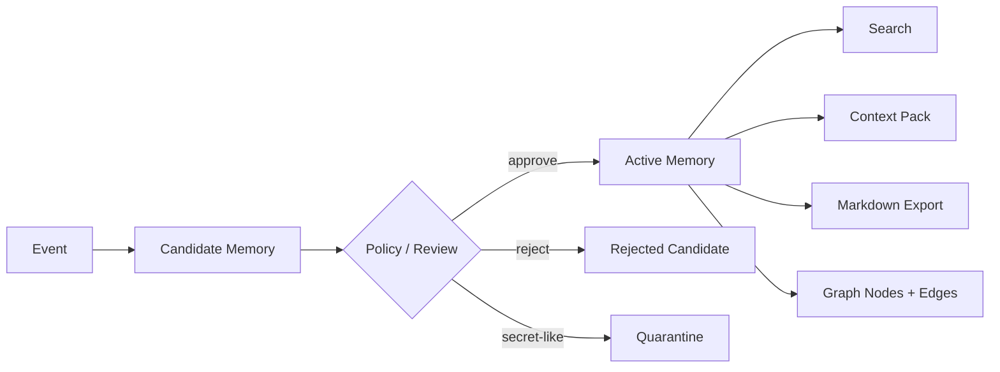

# Agent Memory Kernel

Local-first, auditable memory for AI agents.

Agent Memory Kernel is a small open-source template for giving agents a durable
memory layer without locking the project to one vendor, product, model, or
private workflow. It starts with two default memory lanes:

- `personal`: preferences, recurring personal context, communication style.
- `professional`: projects, decisions, rules, gotchas, working knowledge.

Teams can extend those lanes into project-specific graph trees, success/failure
loops, Hermes adapters, CRM memory, SEO project memory, support memory, or any
other domain-specific layer.

## Why this exists

Most agent memory is either too opaque or too thin:

- chat memory is convenient, but hard to audit, correct, export, or reuse;
- vector search is useful, but it often loses provenance and lifecycle;
- project notes are readable, but agents need structured retrieval and trust
metadata;
- full knowledge graphs are powerful, but too heavy as a first step.

This project takes a middle path: every memory starts as an event, becomes a
candidate, passes review or policy, and only then becomes active memory. Active
memory has source links, trust labels, audit history, graph nodes, and an
agent-ready context pack.

## Status

This is `v0.1.0`: a working local kernel, not a hosted product.

Included now:

- SQLite storage.
- Append-only source events.
- Candidate memory lifecycle.
- Manual review and conservative auto-approval.
- Secret-like content quarantine.
- Active memory search.
- Agent context packs with provenance.
- Basic graph nodes and `relates_to` edges.
- Markdown vault export.
- CLI.
- Tests and demo commands.

Not included yet:

- hosted API server;
- web UI;
- embeddings;
- production LLM extractor;
- production Hermes integration;
- multi-user auth.

## Install

From this repository:

```bash
python3 -m venv .venv
. .venv/bin/activate
pip install -e ".[dev]"
```

Or run directly during development:

```bash
PYTHONPATH=src python3 -m agent_memory_kernel.cli init
```

## Quick Start

Initialize a local database:

```bash
agent-memory init --db .memory/demo.db
```

Record a professional memory candidate:

```bash
agent-memory remember --db .memory/demo.db \
  "Rule: for SEO projects, record both successful and failed content loop attempts." \
  --scope professional
```

Review candidates:

```bash
agent-memory review --db .memory/demo.db list --status pending
```

Approve one candidate:

```bash
agent-memory review --db .memory/demo.db approve cand_xxxxxxxxxxxxxxxx
```

Search active memory:

```bash
agent-memory search --db .memory/demo.db "SEO projects"
```

Build a context pack for an agent:

```bash
agent-memory context-pack --db .memory/demo.db "planning an SEO loop"
```

Export a readable vault:

```bash
agent-memory export --db .memory/demo.db --out memory-vault
```

## Core Model

The kernel uses a simple lifecycle:



Every active memory keeps:

- original event provenance;
- scope;
- kind;
- confidence;
- sensitivity;
- source trust;
- audit trail;
- graph nodes and edges.

## Scopes

The starter scopes are intentionally simple:

- `personal`: user preferences, style, long-lived personal facts.
- `professional`: work memory, project rules, decisions, failures, success
  patterns.
- `project`: optional per-project memory.
- `agent`: agent-specific operational memory.
- `session`: short-lived session memory.

The default public template focuses on `personal` and `professional` so it is
useful for people who do not work with loops. Teams that do work with iterative
systems can add outcome-oriented layers on top.

## SEO / Loop Extension

For SEO projects, the useful extension is not just "remember everything." The
high-value layer is outcome memory:

- what loop was attempted;
- what inputs were used;
- what result was measured;
- what failed;
- what succeeded;
- what rule should future agents reuse or avoid.

That extension can be implemented as a domain schema over this kernel:

```text
attempt -> outcome -> lesson -> reusable_rule
attempt -> failed_because -> gotcha
attempt -> succeeded_because -> pattern
```

See [examples/agent-loop-demo/README.md](examples/agent-loop-demo/README.md).

## Hermes Integration

Hermes should not own the memory. Hermes should call the memory kernel.

Recommended shape:

1. Before planning, Hermes asks the kernel for a context pack.
2. During work, Hermes records events and candidate memories.
3. After work, a reviewer or policy promotes useful candidates.
4. Future agents retrieve only the relevant memory tree instead of scanning old
   chats.

See [docs/hermes-integration.md](docs/hermes-integration.md).

## Implementation Plan

The detailed build plan is in
[docs/implementation-plan.md](docs/implementation-plan.md). It is written so a
future agent or contributor can continue from this template without needing the
original planning conversation.

## Safety Model

The kernel is intentionally conservative:

- raw events are stored locally;
- active memory is separated from candidate memory;
- secret-like values are quarantined;
- every active memory has provenance;
- untrusted sources stay pending by default;
- correction and soft-delete are first-class operations.

This is important because agent memory can otherwise become a prompt-injection
and data-leak surface.

## Development

Run tests:

```bash
PYTHONPATH=src python3 -m unittest discover -s tests
```

Run a CLI smoke test:

```bash
PYTHONPATH=src python3 -m agent_memory_kernel.cli init --db /tmp/amk-demo.db
```

## Project Layout

```text
src/agent_memory_kernel/
  cli.py                 CLI commands
  store.py               SQLite-backed memory store
  policy.py              safety and admission policy
  schema.sql             database schema
  extractors/            deterministic v0 extractor and extension seams
docs/
  implementation-plan.md  phased build plan
  v0-memory-contract.md  lifecycle and data contract
  hermes-integration.md  adapter architecture
  roadmap.md             next milestones
examples/
  personal-professional-demo/
  agent-loop-demo/
templates/
  vault/
tests/
```

## License

MIT.
