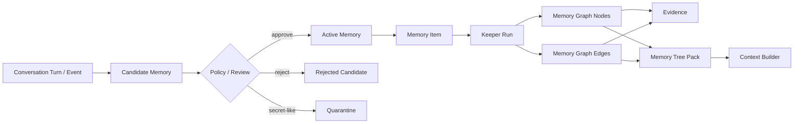

# Agent Memory Kernel

Local-first, auditable memory for AI agents.

Agent Memory Kernel is a small open-source template for giving agents a durable
memory layer without locking the project to one vendor, product, model, or
private workflow. It starts with two default memory lanes:

- `personal`: preferences, recurring personal context, communication style.
- `professional`: projects, decisions, rules, gotchas, working knowledge.

Teams can extend those lanes into project-specific graph trees, success/failure
loops, Hermes adapters, CRM memory, SEO project memory, support memory, or any
other domain-specific layer.

## Why this exists

Most agent memory is either too opaque or too thin:

- chat memory is convenient, but hard to audit, correct, export, or reuse;
- vector search is useful, but it often loses provenance and lifecycle;
- project notes are readable, but agents need structured retrieval and trust
metadata;
- full knowledge graphs are powerful, but too heavy as a first step.

This project takes a middle path: every memory starts as an event, becomes a
candidate, passes review or policy, and only then becomes active memory. Active
memory has source links, trust labels, audit history, graph nodes, and an
agent-ready context pack. When an agent needs deeper working context, the same
data can be returned as a Memory Tree Pack: short branch labels at the top,
active memories in the middle, and raw source excerpts at the bottom.

## Status

This is `v0.1.0`: a working local kernel, not a hosted product.

Included now:

- SQLite storage.
- Append-only source events.
- Candidate memory lifecycle.
- Manual review and conservative auto-approval.
- Secret-like and prompt-injection-like content quarantine.
- Active memory search.
- Agent context packs with provenance.
- Runtime hooks: `before-model-call` and `after-saved-turn`.
- High-level `MemoryOrchestrator` service facade for `before_turn`,
  `build_prompt_context`, `retrieve_context`, `record_turn`,
  `keeper_analyze_turn`, `ingest_graph`, and `after_turn`.
- Formal machine-readable Memory Contract and acceptance harness.
- Versioned public conformance scenarios for adapter compatibility.
- Scope access enforcement for runtime memory retrieval.
- Agent write-policy enforcement for record, auto-approve, review, lifecycle,
  outcome, conflict, and supersession paths.
- Capability/consent reports for read, inject, export, promote, lifecycle, and
  other write actions.
- Correction revision history and rollback for active memories.
- Derived-memory invalidation ledger for correction, rollback, delete,
  distrust, expire, and supersede lifecycle actions.
- Operational status checks and no-memory/failed-Keeper fallbacks for local
  runtime failures.
- Conflict and supersession records for truth maintenance.
- Current-best conflict resolution for prompt-facing tree retrieval.
- First-class outcome records for success/failure loop memory.
- Queued Keeper jobs and `worker` processing.
- Local stdlib HTTP API service: `serve`.
- Dependency-free stdio MCP server: `mcp` / `agent-memory-mcp`.
- Conversation turns, thread messages, and rolling summaries.
- Compact `memory_items`.
- Persistent memory graph nodes and edges.
- Node and edge evidence.
- Keeper runs, graph command normalization, and graph command audit.
- Graph groups and optimization runs.
- Light Model semantic analyses: facts, chronology, key topics, people, events,
  verified entities.
- Versioned LLM Keeper extraction contract through `LLMKeeperExtractor` for
  low-cost model memory writes without requiring a live provider in tests.
- OpenAI-compatible lightweight extractor adapter with deterministic fallback
  for contract tests and local operation.
- Profile intro, profile rules, project profile metadata, and LLM usage stats.
- Combined Router/Keeper/usage observability report for memory operations.
- Digital Brain state: left/right counts, calibration, node hemisphere, visual
  coordinates.
- Guarded Digital Brain style append in provider-neutral prompt envelopes.
- Memory Tree Packs with branches, graph nodes, relationships, and raw provenance.
- Router read-time policy, explainability, usefulness feedback, and memory
  quality reports.
- Dependency-free semantic reranking for Memory Tree retrieval.
- Full context builder with rules, profile, summaries, recent messages, and tree supplement.
- Deterministic vertical slice commands: `slice seed`, `slice run`, `slice assert`.
- Markdown vault export.
- CLI.
- Tests and demo commands.

Not included yet:

- hosted multi-user API server;
- web UI;
- provider embeddings beyond the local deterministic semantic reranker;
- production LLM Keeper eval suite and managed model configuration;
- production Hermes integration;
- multi-user auth.

## Install

From this repository:

```bash
python3 -m venv .venv
. .venv/bin/activate
pip install -e ".[dev]"
```

Or run directly during development:

```bash
PYTHONPATH=src python3 -m agent_memory_kernel.cli init
```

## Quick Start

Initialize a local database:

```bash
agent-memory init --db .memory/demo.db
```

Record a professional memory candidate:

```bash
agent-memory remember --db .memory/demo.db \
  "Rule: for SEO projects, record both successful and failed content loop attempts." \
  --scope professional
```

Review candidates:

```bash
agent-memory review --db .memory/demo.db list --status pending
```

Approve one candidate:

```bash
agent-memory review --db .memory/demo.db approve cand_xxxxxxxxxxxxxxxx
```

Search active memory:

```bash
agent-memory search --db .memory/demo.db "SEO projects"
```

Mark memory truth changes explicitly:

```bash
agent-memory conflict --db .memory/demo.db record mem_old mem_new --reason "newer project rule conflicts"
agent-memory supersede --db .memory/demo.db mem_old mem_new --reason "newer user-stated memory wins"
agent-memory conflict --db .memory/demo.db list --status resolved
agent-memory current-best --db .memory/demo.db --scope professional "project rule"
```

`supersede` suppresses the old memory from retrieval and graph export while
recording a resolved conflict relationship for audit.
`current-best` shows how prompt-facing retrieval resolves explicit conflicts:
resolved winners suppress loser memories, and open conflicts stay visible as
unresolved review items.

Correct and rollback memory:

```bash
agent-memory correct --db .memory/demo.db mem_xxxxxxxxxxxxxxxx \
  "Decision: demo-site target market is B2B SaaS." \
  --reason "user corrected target market"

agent-memory revisions --db .memory/demo.db mem_xxxxxxxxxxxxxxxx
agent-memory rollback --db .memory/demo.db mem_xxxxxxxxxxxxxxxx \
  --revision-id revn_xxxxxxxxxxxxxxxx \
  --reason "restore previous wording"
```

Corrections store before/after text in `memory_revisions`. Rollback restores
the prior text, propagates the change to memory items and graph summaries, and
records a new rollback revision plus audit event.

Record a loop outcome:

```bash
agent-memory outcome --db .memory/demo.db record \
  --project demo-site \
  --status success \
  --action "Updated search intent and internal links." \
  --result "Organic clicks improved after publishing." \
  --lesson "Refresh intent and internal links together." \
  --next-recommendation "Reuse this pattern on similar pages." \
  --approve

agent-memory outcome --db .memory/demo.db pack --project demo-site
```

Outcome records keep structured attempt/result/cause/lesson fields and can also
create normal memory candidates, so they remain reviewable and provenance-backed.

Build a context pack for an agent:

```bash
agent-memory context-pack --db .memory/demo.db "planning an SEO loop"
```

Build a tree pack for an agent before planning:

```bash
agent-memory tree-pack --db .memory/demo.db "planning an SEO loop" --scope professional
```

Inspect the persistent graph tree:

```bash
agent-memory graph --db .memory/demo.db nodes --scope professional
agent-memory graph --db .memory/demo.db edges --scope professional
agent-memory graph --db .memory/demo.db groups --scope professional
agent-memory graph --db .memory/demo.db analyses --scope professional
agent-memory graph --db .memory/demo.db keeper-runs
agent-memory graph --db .memory/demo.db brain-style --scope professional
agent-memory graph --db .memory/demo.db optimize --mode record_linkage --scope professional
```

Build the richer context that Hermes would pass to an agent:

```bash
agent-memory build-context --db .memory/demo.db "planning an SEO loop" --scope professional
```

Runtime prompt envelopes can suppress graph-derived style hints when an
orchestrator policy wants memory content but not style influence:

```bash
agent-memory before-model-call --db .memory/demo.db "planning an SEO loop" \
  --scope professional \
  --disable-brain-style
```

Inspect why the Router selected memory for a prompt:

```bash
agent-memory read-time-policy --db .memory/demo.db --scope professional
agent-memory router-runs --db .memory/demo.db --thread-id seo-demo
agent-memory router-explain --db .memory/demo.db router_xxxxxxxxxxxxxxxx
```

Inspect what changed after a saved turn:

```bash
agent-memory after-saved-turn --db .memory/demo.db \
  --thread-id seo-demo \
  --scope professional \
  --user-text "Plan the next SEO loop." \
  --assistant-text "Reuse the prior successful refresh pattern."

agent-memory memory-changes --db .memory/demo.db --keeper-job-id kjob_xxxxxxxxxxxxxxxx
agent-memory memory-changes --db .memory/demo.db --thread-id seo-demo
```

`memory-changes` explains the saved turns, Keeper event, candidate memories,
promoted active memories, affected graph/context surfaces, review or lifecycle
handles, and audit trail for a post-turn memory update.

Record whether selected memory helped and inspect quality signals:

```bash
agent-memory router-feedback --db .memory/demo.db record router_xxxxxxxxxxxxxxxx \
  --memory-id mem_xxxxxxxxxxxxxxxx \
  --rating helpful \
  --reason "grounded the plan"

agent-memory router-feedback --db .memory/demo.db list --router-run-id router_xxxxxxxxxxxxxxxx
agent-memory memory-quality --db .memory/demo.db --scope professional
agent-memory observability --db .memory/demo.db --scope professional
agent-memory current-best --db .memory/demo.db --scope professional "planning an SEO loop"
```

Inspect the formal memory contract and run the deterministic full-memory gate:

```bash
agent-memory contract
agent-memory contract assert
agent-memory acceptance seed --db .memory/acceptance.db
agent-memory acceptance assert --db .memory/acceptance.db
agent-memory conformance spec
agent-memory conformance seed --db .memory/conformance.db
agent-memory conformance assert --db .memory/conformance.db
```

The acceptance harness checks the minimum closed-loop behavior: selected memory
beats a no-memory baseline, personal memory does not leak into professional
prompts, unsafe memory is absent, source ids are logged, correction/rollback
affect retrieval, Keeper writes stay reviewable, and write policy blocks
unauthorized promotion.

The conformance suite is the public compatibility layer. It checks named
scenarios for professional memory injection, stored read-policy denial,
personal-lane isolation, resolved conflict suppression, deleted-memory absence,
unsafe-memory absence, and reviewable/idempotent Keeper writes. Adapters can use
it as the first "does this behave like Agent Memory Kernel?" gate.

Record profile and usage metadata:

```bash
agent-memory profile --db .memory/demo.db set-intro "This workspace works on SEO projects."
agent-memory profile --db .memory/demo.db add-rule "Always retrieve memory before planning."
agent-memory usage --db .memory/demo.db record --model gpt-4.1-mini --prompt-tokens 100 --completion-tokens 40
agent-memory observability --db .memory/demo.db --thread-id seo-demo
agent-memory export-profile --db .memory/demo.db --scope professional
agent-memory import-profile --db .memory/restored.db exported-profile.json
```

Configure agent write authority:

```bash
agent-memory write-policy --db .memory/demo.db set \
  --agent-id writer \
  --scope professional \
  --action auto_approve \
  --decision deny \
  --reason "writer proposes memory; reviewer approves"

agent-memory write-policy --db .memory/demo.db list --agent-id writer
```

When `auto_approve` is denied, raw events are still stored but durable active
memory stays as a review candidate. Destructive or lifecycle actions such as
`approve`, `correct`, `delete`, `distrust`, `expire`, `conflict`, and
`supersede` are blocked with an audited `write_denied` event when policy denies
them.

Configure agent read/injection authority:

```bash
agent-memory read-policy --db .memory/demo.db set \
  --agent-id writer \
  --scope personal \
  --action inject \
  --decision deny \
  --reason "writer cannot inject personal memory"

agent-memory read-policy --db .memory/demo.db list --agent-id writer
```

When `inject` is denied, `before-model-call` returns a no-memory envelope for
that scope, logs a `read_denied` audit event, and records the matched policy in
prompt metadata.

Check the effective capability matrix before delegating work to an agent:

```bash
agent-memory capability --db .memory/demo.db \
  --actor writer \
  --scope professional
```

The report shows read actions (`read`, `inject`, `export`) and write actions
(`record`, `approve`, `delete`, `distrust`, `supersede`, and others) with the
matched policy, reason, and denied actions. Direct `search`, `context-pack`,
`graph tree`, and profile/markdown export calls can take `--actor` so denied
read/export policies are enforced outside the prompt hook too.

Inspect derived-memory invalidation after corrections or lifecycle changes:

```bash
agent-memory derived-invalidations --db .memory/demo.db --scope professional
agent-memory derived-invalidations --db .memory/demo.db --memory-id mem_xxxxxxxxxxxxxxxx
```

The report shows which graph, evidence, prompt-pack, export, and graph-derived
style surfaces were refreshed or invalidated so stale memory cannot silently
survive in derived context.

Use a model-backed extractor from an application:

```python
from agent_memory_kernel import MemoryStore
from agent_memory_kernel.extractors import LLMKeeperExtractor


def cheap_model_complete(request: dict):
    return provider.responses.create(**request)

store = MemoryStore(
    ".memory/demo.db",
    extractor=LLMKeeperExtractor(cheap_model_complete, model="cheap-memory-model"),
)
```

For OpenAI-compatible clients that should be passed directly, see
`OpenAIExtractor`. The versioned Keeper contract itself is documented in
[docs/keeper-extraction.md](docs/keeper-extraction.md).

Export a readable vault:

```bash
agent-memory export --db .memory/demo.db --out memory-vault
```

## Core Model

The kernel uses a simple lifecycle:



Every active memory keeps:

- original event provenance;
- scope;
- kind;
- confidence;
- sensitivity;
- source trust;
- audit trail;
- compact memory item;
- graph nodes, graph edges, and evidence.

## Scopes

The starter scopes are intentionally simple:

- `personal`: user preferences, style, long-lived personal facts.
- `professional`: work memory, project rules, decisions, failures, success
  patterns.
- `project`: optional per-project memory.
- `agent`: agent-specific operational memory.
- `session`: short-lived session memory.

The default public template focuses on `personal` and `professional` so it is
useful for people who do not work with loops. Teams that do work with iterative
systems can add outcome-oriented layers on top.

## Memory Tree Pack

The Memory Tree Pack is the main agent-facing retrieval format for planning
work. Tags and graph nodes help the kernel route the query, but the agent gets
grounded context:

```text
Root query
  Branch: project / demo-site
    Why selected
    Active memories
    Related graph nodes
    Raw provenance excerpts
```

This keeps the top of the tree compact while still letting an agent inspect the
source conversation, session summary, decision, or tool result that created a
memory. It is designed for Hermes-style orchestration: ask for the tree before
planning, then record new events after the work.

Under the hood, approved memories now flow through a Keeper step:

```text
event -> candidate -> active memory -> memory_item
      -> memory_graph_nodes / memory_graph_edges
      -> node_evidence / edge_evidence
      -> semantic_analyses / graph_groups / digital_brain_state
      -> tree-pack / build-context
```

The starter Keeper is deterministic and dependency-free. It already writes the
same structural slots expected by a richer model-backed implementation:
entities, links, commands, normalized nodes, dedupe keys, blobs, importance, and
embedding fields. The starter Light Model also records facts, chronology, key
topics, people, events, and verified entities.

## SEO / Loop Extension

For SEO projects, the useful extension is not just "remember everything." The
high-value layer is outcome memory:

- what loop was attempted;
- what inputs were used;
- what result was measured;
- what failed;
- what succeeded;
- what rule should future agents reuse or avoid.

That extension can be implemented as a domain schema over this kernel:

```text
attempt -> outcome -> lesson -> reusable_rule
attempt -> failed_because -> gotcha
attempt -> succeeded_because -> pattern
```

The starter implementation exposes this as `agent-memory outcome record/list/pack`
and `/outcome/record`, `/outcome/list`, `/outcome/pack`.

See [examples/agent-loop-demo/README.md](examples/agent-loop-demo/README.md).

## Hermes Integration

Hermes should not own the memory. Hermes should call the memory kernel.

Recommended shape:

1. Before planning, Hermes asks the kernel for a Memory Tree Pack.
2. During work, Hermes records events and candidate memories.
3. After work, a reviewer or policy promotes useful candidates.
4. Future agents retrieve only the relevant memory tree instead of scanning old
   chats.

See [docs/hermes-integration.md](docs/hermes-integration.md).

Runtime hook shape:

```bash
agent-memory before-model-call "Plan the next SEO loop" \
  --thread-id seo-demo \
  --scope professional \
  --allowed-scopes professional \
  --agent-id writer \
  --model-id gpt-4.1-mini

agent-memory after-saved-turn \
  --thread-id seo-demo \
  --scope professional \
  --keeper-mode queued \
  --user-text "Plan the next SEO loop" \
  --assistant-text "Use the prior successful refresh pattern."

agent-memory write-policy set \
  --agent-id writer \
  --scope professional \
  --action auto_approve \
  --decision deny \
  --reason "production writers propose memory for review"

agent-memory worker --db .memory/demo.db --once --limit 10

agent-memory worker --db .memory/demo.db --daemon --poll-interval 5 --limit 10

agent-memory shadow-turn "Plan the next SEO loop" \
  --thread-id seo-demo \
  --scope professional \
  --user-text "Plan the next SEO loop" \
  --assistant-text "Use the prior successful refresh pattern."

agent-memory shadow-traces --thread-id seo-demo

agent-memory shadow-eval trace_xxxxxxxxxxxxxxxx \
  --expected-json '{"expected_branch_labels":["seo-demo"],"require_candidates":true}'

agent-memory shadow-evals --shadow-trace-id trace_xxxxxxxxxxxxxxxx
```

The first command returns a provider-neutral prompt envelope with a selected
`MEMORY_TREE_SUPPLEMENT`. The second command records the exchange and creates
reviewable Keeper candidates in sync mode or queues the Keeper job in queued
mode. The worker command processes queued Keeper jobs.
Use `--daemon` for a long-running polling worker under a process supervisor;
`--max-iterations` and `--stop-when-idle` are available for bounded test or
maintenance runs.

For a CLI walkthrough of the full policy/review loop, see
[examples/hermes-e2e-demo/README.md](examples/hermes-e2e-demo/README.md).

Use `shadow-turn` before a production rollout. It links one Router run and one
Keeper job into a reviewable trace with `write_policy=propose_only`: turns and
candidate memories are recorded, but nothing is auto-approved into active
memory. Reviewing the first traces is the fastest way to build Router/Keeper
eval fixtures. `shadow-eval` stores repeatable quality checks for a trace:
expected or forbidden branch labels, candidate text, source IDs, token budget,
and whether Keeper candidates were expected.

Run the stdio MCP server when an external agent supports MCP tools:

```bash
agent-memory mcp --db .memory/demo.db
# or
agent-memory-mcp --db .memory/demo.db
```

The MCP server exposes the same orchestrator surface as the HTTP API, including
`memory_before_model_call`, `memory_before_turn`,
`memory_build_prompt_context`, `memory_after_saved_turn`, `memory_after_turn`,
`memory_retrieve_context`, `memory_ingest_graph`, `memory_changes`,
`memory_search`, `memory_tree_pack`, `memory_review_list`,
`memory_capability_check`, `memory_derived_invalidations`,
`memory_operational_status`, `memory_observability`, `memory_graph_nodes`,
`memory_graph_edges`, and `memory_worker_run`.

## Implementation Plan

The detailed build plan is in
[docs/implementation-plan.md](docs/implementation-plan.md). It is written so a
future agent or contributor can continue from this template without needing the
original planning conversation.

The gap plan for the full automatic memory system is in
[docs/full-memory-gap-plan.md](docs/full-memory-gap-plan.md). It maps the
reference-memory findings to the missing repository layers: automatic Keeper,
Memory Router, prompt envelope, Hermes hooks, API/MCP service mode, review, and
security hardening.

The full-memory work is split into hard contracts so contributors can implement
it without relying on the original planning conversation:

- [docs/runtime-contract.md](docs/runtime-contract.md) defines the live
  `before_model_call` / `after_saved_turn` loop.
- [docs/memory-lifecycle-contract.md](docs/memory-lifecycle-contract.md)
  defines create, correct, delete, distrust, expire, conflict, and export
  behavior.
- [docs/cross-model-context-contract.md](docs/cross-model-context-contract.md)
  defines the provider-neutral prompt envelope and Memory Tree Supplement.
- [docs/security-identity-contract.md](docs/security-identity-contract.md)
  defines identity, permissions, trust, audit, and leakage controls.
- [docs/end-to-end-vertical-slice.md](docs/end-to-end-vertical-slice.md)
  defines the first executable full-memory scenario.

## Safety Model

The kernel is intentionally conservative:

- raw events are stored locally;
- active memory is separated from candidate memory;
- secret-like values are quarantined;
- every active memory has provenance;
- untrusted sources stay pending by default;
- correction, soft-delete, distrust, and expiration are first-class operations.

This is important because agent memory can otherwise become a prompt-injection
and data-leak surface.

## Development

Run tests:

```bash
PYTHONPATH=src python3 -m unittest discover -s tests
```

Run a CLI smoke test:

```bash
PYTHONPATH=src python3 -m agent_memory_kernel.cli init --db /tmp/amk-demo.db
```

## Project Layout

```text
src/agent_memory_kernel/
  cli.py                 CLI commands
  orchestrator.py        high-level memory lifecycle facade
  graph_commands.py      safe Keeper graph command normalization
  store.py               SQLite-backed memory store
  policy.py              safety and admission policy
  server.py              stdlib HTTP API service
  mcp_server.py          stdio MCP server
  schema.sql             database schema
  slice.py               deterministic full-memory vertical slice fixture
  extractors/            deterministic v0 extractor and extension seams
docs/
  implementation-plan.md  phased build plan
  full-memory-gap-plan.md  gap plan for automatic full memory
  runtime-contract.md      pre-call router and post-turn keeper contract
  observability.md         Router, Keeper, and usage telemetry report
  memory-lifecycle-contract.md  durable memory lifecycle contract
  keeper-extraction.md    versioned low-cost keeper extraction contract
  cross-model-context-contract.md  provider-neutral prompt context contract
  security-identity-contract.md  identity, permissions, and trust contract
  end-to-end-vertical-slice.md  first full-memory acceptance scenario
  memory-tree-pack.md     tree-shaped retrieval format
  v0-memory-contract.md  lifecycle and data contract
  hermes-integration.md  adapter architecture
  roadmap.md             next milestones
examples/
  personal-professional-demo/
  agent-loop-demo/
  hermes-e2e-demo/
templates/
  vault/
tests/
```

## License

MIT.
