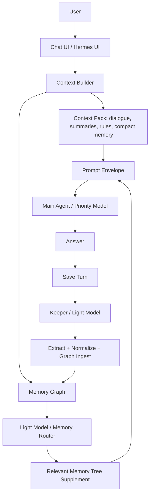

# Full Memory System - Implementation Plan

**Goal:** turn Agent Memory Kernel into an automatic cross-model memory layer where a lightweight model maintains a graph tree and injects relevant node content into the prompt before any main agent answers.
**Timeline:** 2-4 weeks for a usable local v0.2, 4-8 weeks for API/MCP, review UI, and production hardening.
**Dependencies:** Hermes hook points, one low-cost LLM provider key, SQLite migration discipline, prompt-boundary policy, and realistic conversation transcripts for tests.

---

## Findings From The Reference Material

The memory system described in the transcript has these core properties:

- Memory is external to the chat models. Switching between models keeps the same memory because the context is injected before each model call.
- The default tree separates user/person memory from interests or professional work memory.
- Users do not manually tag messages. A lightweight model checks each message and decides what belongs in the graph tree.
- The graph is not just tags. Nodes contain expanded information, provenance, and deeper branch content.
- Before a reply, a lightweight router walks the graph, finds the most relevant node or nodes, and places their expanded content into the prompt.
- After a turn, a keeper extracts topics, facts, entities, relationships, preferences, decisions, and useful context, then updates the graph tree.
- The main agent should receive a prepared prompt envelope, not spend tokens searching all historical data by itself.

Visible public signals from the reference site support the same direction:

- Memory Tree / Memory Graph are positioned as structured knowledge graphs.
- Personal understanding, user rules, and profile intro are separate user-facing
  memory surfaces.
- Context and memory are described as following the user across model providers.
- Export/import is positioned as a project profile capability containing memory
  tree data, chat history, model choices, rules, and settings.
- Lightweight semantic processing is described for filtering, summaries,
  metadata, people, events, chronology, and verified entities.

The exact server prompts, graph traversal policy, and Keeper implementation are
not public. This repository should therefore implement a clear, testable
Router/Keeper contract instead of implying a private backend clone.

## Council Verdict: Full Memory Completion Bar

The repository now has a strong memory substrate, but the council review did
not consider it complete full memory yet. The missing core is not another graph
table. It is governed retrieval, lifecycle correctness, operator control, and
behavioral proof.

Must-have before claiming full memory:

1. **Read-time decision policy.** Define how Router chooses branches using
   relevance, recency, scope, source trust, sensitivity, conflict status, graph
   distance, outcome success, pinned memory, token budget, and whether memory is
   evidence or instruction.
2. **Memory quality contract.** Track and evaluate Keeper extraction quality,
   Router selection quality, stale-memory avoidance, and memory-vs-no-memory
   task improvement.
3. **Derived-memory invalidation.** Corrections, deletes, distrust, expiry, and
   supersession must propagate through summaries, graph edges, tree packs,
   cached envelopes, outcome lessons, and graph-derived style state.
4. **Current-best resolver.** Conflicts need a retrieval-time answer based on
   temporal precedence, source confidence, trust, supersession, and explicit
   unresolved conflict handling.
5. **Capability and consent model.** Define who can read, write, promote,
   inject, distrust, export, or delete each memory under multi-agent
   orchestration.
6. **Inspection and explainability.** Provide CLI/HTTP flows for "what do you
   remember?", "why was this injected?", "what changed after the last turn?",
   source provenance, undo, distrust, and export.
   Baseline implemented for post-turn changes through `agent-memory
   memory-changes` and `/memory-changes`: a Keeper job can be inspected with
   saved turns, event, candidates, promoted memories, affected graph/context
   surfaces, operator handles, and audit trail.
7. **Reference orchestration loop.** Provide one runnable Hermes-style demo
   where memory is saved, extracted, retrieved, injected, corrected, deleted,
   and then absent from the next prompt.
8. **Idempotent Keeper and consolidation loop.** Retries must not duplicate
   facts, edges, outcomes, or evidence; periodic merge/split/decay/compaction
   should be first-class.
   Baseline implemented for `after_saved_turn`: repeated sync or queued Keeper
   calls with the same runtime payload reuse the existing Keeper job and do not
   duplicate turns, events, candidates, or graph writes.
9. **Prompt-boundary red-team fixtures.** Prove hostile stored evidence, tool
   output, assistant guesses, and cross-lane content cannot become hidden
   instructions.
10. **Style influence governance.** Graph-derived style hints must be scoped,
    advisory, visible, suppressible, and evaluated separately from factual
    memory.
11. **Operational failure model.** Define latency budgets, no-memory fallback,
    corruption checks, backup/restore, migration behavior, storage growth, and
    what happens when memory is unavailable or partially inconsistent.
12. **Plain-language model and glossary.** Explain memory, lane, branch,
    Router, Keeper, supplement, and profile surfaces with one canonical diagram
    so open-source users can understand the system without private context.
13. **Versioned conformance spec.** Publish golden conversation traces,
    expected memory mutations, expected retrieval/refusal behavior, migration
    compatibility checks, and adapter conformance tests so outside projects can
    prove they implement the memory behavior instead of only copying the API.
    Baseline implemented through `agent-memory conformance spec/seed/run/assert`
    and `/conformance/spec`, `/conformance/seed`, `/conformance/run`,
    `/conformance/assert`; remaining work is broader golden traces, migration
    checks, and external adapter badges.

## Additional Runtime Architecture Notes

The reference behavior should be implemented as one memory service with two
lightweight-model paths around the main model call:



The main agent must not scan the full graph or decide which historical branches
to inspect. That is the Router's job. The main agent receives only the selected
context package:

- system core;
- rules digest;
- user profile and addressing hints;
- compact active memory;
- older thread excerpts and summaries;
- `MEMORY_TREE_SUPPLEMENT` with expanded node content;
- recent messages;
- current user message.

The lightweight model therefore has two different responsibilities:

- **Memory Router before answer:** fetch `context_pack` and `memory_graph`, rank
  relevant branches, and assemble a `MEMORY_TREE_SUPPLEMENT`.
- **Keeper after answer:** inspect the saved exchange, extract entities,
  relationships, interests, decisions, rules, attempts, outcomes, gotchas, and
  profile facts, normalize them against existing nodes, and apply safe graph
  commands.

There is also an optional "brain/style" append path: graph-level analytics can
derive a soft style instruction, but it must be appended as a guarded system
preference and must never override user instructions, safety, or factual
accuracy.

For Hermes, this means the repository should expose a Memory Orchestrator or
Keeper service with these high-level operations:

- `record_turn` stores the complete exchange.
- `keeper_analyze_turn` turns the exchange into graph updates.
- `retrieve_context` selects relevant graph branches before the main model call.
- `build_prompt_context` returns the final prompt envelope.
- `ingest_graph` applies node, edge, summary, and evidence changes.

## Current Repository State

Already present:

- SQLite source of truth.
- Raw events, candidate memories, active memories, review actions, correction, delete, and export.
- Memory revision history and rollback for corrected active memories.
- Conversation turns, thread messages, and thread summaries.
- `memory_items`, `memory_graph_nodes`, `memory_graph_edges`, node evidence, and edge evidence.
- Keeper run and graph command audit tables.
- Deterministic rule-based extraction and graph construction.
- OpenAI-compatible lightweight extractor adapter with deterministic fallback.
- Semantic analysis slots for facts, chronology, key topics, people, events, and verified entities.
- Personal and professional lanes.
- Agent write-policy table and enforcement for record, auto-approve, review,
  lifecycle, outcome, conflict, and supersession paths.
- Baseline capability and consent reporting through `agent-memory capability`,
  `/capability/check`, the Hermes provider wrapper, and MCP
  `memory_capability_check`, with read/export enforcement on direct retrieval
  and export surfaces.
- Baseline derived-memory invalidation ledger through `agent-memory
  derived-invalidations`, `/derived-invalidations`, the Hermes provider wrapper,
  and MCP `memory_derived_invalidations`; correction, rollback, delete,
  distrust, expire, and supersede actions record affected graph, evidence,
  prompt-pack, export, and graph-derived style surfaces.
- Baseline operational failure behavior through `operational_status`,
  `/operational/status`, the Hermes provider wrapper, and MCP
  `memory_operational_status`; Router/context failures return a no-memory
  envelope with `metadata.operational_failure`, and Keeper extraction failures
  keep saved turns while marking the Keeper job failed.
- Baseline migration and recovery behavior through `migration_status`,
  `backup_database`, `restore_database`, `agent-memory migration-status`,
  `agent-memory backup`, `agent-memory restore`, `/migration/status`,
  `/backup`, `/restore`, and MCP recovery tools; backup/restore use the SQLite
  backup API and migration status checks required tables, columns, user version,
  and SQLite quick check.
- Memory Tree Pack and full context builder output.
- Dependency-free semantic reranking for Memory Tree retrieval.
- Guarded brain/style system-prompt append derived from graph analytics.
- Baseline versioned LLM Keeper extraction contract through
  `LLMKeeperExtractor`, `keeper-extraction-v0.1`, local schema validation,
  deterministic fallback, and candidate extraction metadata.
- Baseline graph command normalization through `graph-command-v0.1`,
  `apply_graph_commands`, `ingest_graph`, reviewable proposed commands,
  approval-time graph mutation, node/edge evidence, and idempotent graph
  upserts.
- Baseline read-time policy and Router explainability through prompt metadata,
  `router_runs`, `/router-explain`, and `agent-memory router-explain`.
- Baseline Router usefulness feedback through `router_feedback`,
  `/router-feedback/record`, `/memory-quality`, and `agent-memory memory-quality`.
- Baseline observability and cost accounting through `memory_observability_report`,
  `agent-memory observability`, `/observability`, the Hermes provider wrapper,
  and MCP `memory_observability`; the report joins Router selected branches and
  prompt token estimates, Keeper job status/warnings, and LLM usage tokens/cost.
- Baseline post-turn change inspection through `agent-memory memory-changes`
  and `/memory-changes`, including saved turns, Keeper event, candidates,
  promoted memories, affected surfaces, handles, and audit trail.
- Baseline operator review inbox through `agent-memory review inbox`,
  `/review/inbox`, the Hermes provider wrapper, and MCP `memory_review_inbox`;
  inbox items include source previews, risk flags, inline possible-conflict
  warnings against active memory, graph previews, review history, audit trail,
  and CLI/HTTP/MCP handles for approve, reject, correct, delete, distrust, and
  expire.
- Baseline batch review through `agent-memory review batch`, `/review/batch`,
  Hermes `review_batch()`, and MCP `memory_review_batch`; approve/reject
  batches support dry-run and per-candidate results.
- Baseline active-memory lifecycle batch through `agent-memory lifecycle-batch`,
  `/memory/lifecycle-batch`, Hermes `batch_memory_lifecycle()`, and MCP
  `memory_lifecycle_batch`; correct/delete/distrust/expire operations support
  dry-run and per-item results.
- Baseline graph browser data through `agent-memory graph browser`,
  `/graph/browser`, Hermes `graph_browser()`, and MCP `memory_graph_browser`;
  graph nodes and edges include source previews.
- Baseline operator notification queue through `agent-memory notifications`,
  `/notifications/*`, Hermes notification wrappers, and MCP
  `memory_notifications_list` / `memory_notification_assign` /
  `memory_notification_ack` / `memory_notification_resolve` /
  `memory_notification_escalations`; review candidates, sensitive export
  approvals, and expired export artifacts produce open notifications with
  operator handles, reviewer assignment/filtering, computed SLA status from
  `due_at`, and policy-only escalation reports.
- Baseline export governance through `agent-memory export-control`,
  `/export/control`, Hermes `export_control_report()`, and MCP
  `memory_export_control`; export previews show policy decisions, aggregate
  scope counts, sensitivity/trust breakdowns, denied scopes, and risk flags
  without returning memory content.
- Baseline export redaction profiles through `agent-memory export-profile`,
  `agent-memory export`, `/export/profile`, Hermes `export_profile()`, and MCP
  `memory_export_profile`; `full`, `safe`, and `metadata` profiles preserve
  export shape while making content inclusion explicit.
- Baseline sensitive full-export approval through `agent-memory
  export-approval`, `/export/approval/*`, Hermes export approval wrappers, and
  MCP `memory_export_approval_*`; full exports containing personal or secret
  active memory require an approved one-time request.
- Baseline export retention ledger through `agent-memory export-retention`,
  `/export/retention/*`, Hermes retention wrappers, MCP
  `memory_export_retention_*`, and Markdown export manifests; real exports are
  recorded with retention days, expiry, and purge status.
- Baseline encrypted profile export through `agent-memory
  export-encrypted-profile`, `agent-memory import-encrypted-profile`,
  `/export/encrypted-profile`, `/import/encrypted-profile`, Hermes encrypted
  export wrappers, and MCP `memory_export_encrypted_profile` /
  `memory_import_encrypted_profile`; envelopes use `encrypted-export-v0.1`
  with passphrase-derived keys, ChaCha20 stream encryption, and HMAC
  authentication.
- Baseline export custody through `agent-memory export-custody`,
  `/export/custody`, Hermes `export_custody_report()`, and MCP
  `memory_export_custody`; reports verify export policy, sensitive approval,
  passphrase environment configuration, off-host artifact reference, retention,
  and zero secret storage in SQLite.
- Baseline file-based vault adapter through `agent-memory vault export/import`,
  `/vault/export`, `/vault/import`, Hermes `export_vault()` / `import_vault()`,
  and MCP `memory_vault_export` / `memory_vault_import`; exports use
  dependency-free markdown files with JSON frontmatter and imports flow through
  the normal review lifecycle.
- High-level `MemoryOrchestrator` facade with `before_turn`,
  `build_prompt_context`, `retrieve_context`, `record_turn`,
  `keeper_analyze_turn`, `ingest_graph`, and `after_turn`, exposed through the
  Hermes provider plus HTTP/MCP aliases.
- Provider-neutral prompt envelope via `before_model_call`.
- Post-turn Keeper candidate path via `after_saved_turn`.
- Queued Keeper jobs and worker processing for post-turn analysis.
- Baseline long-running Keeper worker daemon through `agent-memory worker
  --daemon`, bounded `--max-iterations`/`--stop-when-idle` controls for tests
  or supervised maintenance, and failed queued-Keeper job recording instead of
  worker crashes.
- Shadow rollout traces that link Router selection and Keeper proposals with
  `write_policy=propose_only`.
- Baseline shadow trace evals for branch selection, Keeper candidate text,
  source IDs, token budget, and access mode.
- Explicit conflict and supersession records that suppress superseded memory
  from active retrieval and graph export.
- First-class outcome records and outcome packs for success/failure loop
  planning.
- Deterministic `slice seed/run/assert` vertical fixture.
- Basic prompt-injection-like quarantine.
- Hermes provider example with `context_pack`, `tree_pack`, `context_builder_pack`, `record_turn`, `remember`, graph inspection, profile, and usage methods.
- Local stdlib HTTP API service for runtime hooks, review/list operations, and
  browser review/graph/conflict pages.
- Dependency-free stdio MCP server for agents that should call the same memory
  orchestrator through MCP tools instead of CLI, imports, or HTTP.
- CLI and tests.
- Formal machine-readable Memory Contract with lane, trust, sensitivity, write
  action, closed-loop, and acceptance gate definitions.
- Deterministic full-memory acceptance harness exposed through CLI and HTTP:
  contract shape, vertical slice, memory-vs-no-memory baseline, lane isolation,
  unsafe-memory exclusion, source logging, rollback retrieval, reviewable Keeper
  writes, and write-policy enforcement.

Remaining for full memory:

- Production rollout that wires `before_turn` and `after_turn` into each live
  external Hermes agent path by default.
- Production-grade read-time ranking beyond the baseline deterministic policy.
- Production memory quality contract with broader behavioral metrics and golden
  fixtures.
- Production derived-memory invalidation beyond the baseline ledger, including
  richer summary dependency tracking, provider embeddings, cached prompt stores,
  and outcome lesson lineage.
- Production current-best heuristics for stale, conflicting, superseded, or
  equal-trust claims beyond explicit resolved conflicts.
- Production hosted identity and delegation flows beyond the baseline local
  capability/consent report for read/write/promote/inject/export/delete.
- Broader inspection flows for batch correction and web UI review beyond the
  baseline Router explain, post-turn memory-change, review inbox/export-control,
  and export retention endpoints.
- A runnable reference loop proving Router -> prompt envelope -> main agent ->
  Keeper -> graph update across correction, deletion, and outcome recall.
- Graph consolidation/compaction behavior beyond the baseline idempotent
  post-turn Keeper retry guard and graph command upserts.
- Production LLM-backed Keeper eval suite, managed model configuration,
  provider-specific adapters, and reviewed extraction prompts for
  natural-language graph updates beyond the baseline schema contract.
- Advanced Memory Router ranking beyond deterministic lexical/graph retrieval.
- Deeper prompt budget adapters per model provider.
- Production evals for guarded brain/style append across real prompt adapters.
- Production Hermes runtime hooks that call memory before and after agent work.
- Production Router/Keeper eval suites built from reviewed real shadow traces.
- Broader conformance traces for migration, adapter compatibility, and
  real-world memory behavior beyond the baseline public suite.
- Production worker supervision beyond the baseline daemon loop, including
  systemd/launchd examples, restart policies, health alerts, and deployment
  recipes.
- Broader hosted/remote MCP deployment patterns for agents that should not use
  local stdio.
- Approximate-nearest-neighbor indexes, live embedding provider certification,
  and production semantic reranking beyond the provider-neutral local contract.
- Richer outcome comparison, scoring, and automatic lesson extraction.
- Richer browser batch editing queues, deeper graph exploration views, and
  managed push/email/web delivery beyond the baseline browser review, graph,
  and conflict pages, machine-readable review inbox with inline conflict
  warnings, notification queue, transport payload builder, approve/reject batch
  flow, and active-memory lifecycle batch correction flow.
- Hosted identity, tenancy, and delegation rules beyond the local
  agent/scope/action capability report and read/write policies.
- Production current-best-answer resolution beyond the baseline explicit
  conflict resolver and active-memory conflict detector.
- Broader provider adapters for the prompt envelope.
- Broader prompt-injection, source trust, and secret red-team fixtures.
- Production observability beyond the baseline report, including wall-clock
  latency, provider billing reconciliation, retention policies, dashboards, and
  alerts.
- Production operational failure behavior beyond the local baseline for slow,
  unavailable, corrupted, partially migrated, or oversized memory stores,
  including latency budgets, encrypted off-host backups, restore drills,
  migration changelogs, worker supervision, and hosted alerting.
- Real production acceptance traces proving behavior improvement on live agent
  tasks beyond the deterministic local fixture.

---

## Council Hardening Addendum

The architecture is directionally correct, but it is not full memory until the
following contracts are real and tested:

1. Runtime contract:
   [runtime-contract.md](runtime-contract.md) defines `before_model_call`,
   `after_saved_turn`, Router output, Keeper output, and failure behavior.
2. Memory lifecycle contract:
   [memory-lifecycle-contract.md](memory-lifecycle-contract.md) defines create,
   correct, delete, distrust, expire, conflict, export, and derived-memory
   invalidation.
3. Cross-model context contract:
   [cross-model-context-contract.md](cross-model-context-contract.md) defines
   the provider-neutral prompt envelope, token-budget adapters, and
   `MEMORY_TREE_SUPPLEMENT`.
4. Security and identity contract:
   [security-identity-contract.md](security-identity-contract.md) defines
   identity, scopes, permissions, redaction, audit, and poisoning defense.
5. End-to-end vertical slice:
   [end-to-end-vertical-slice.md](end-to-end-vertical-slice.md) defines the
   first scenario that must pass before the system can be called complete.
6. Memory contract:
   [memory-contract.md](memory-contract.md) defines lane precedence,
   read/write policy, typed memory, and deterministic acceptance gates.

The biggest risk is not graph shape. The biggest risk is letting untrusted or
unauthorized memory become prompt context without provenance, correction,
deletion, redaction, and audit controls.

### Step 1: Lock The Full Memory Contract

**What we do:** Define the exact read/write contract for automatic memory: pre-turn context, post-turn ingest, graph update commands, router output, and prompt envelope output.

**Files:**

- Modify `docs/v0-memory-contract.md`.
- Modify `docs/hermes-integration.md`.
- Add/maintain `docs/runtime-contract.md`.
- Add/maintain `docs/memory-lifecycle-contract.md`.
- Add/maintain `docs/cross-model-context-contract.md`.
- Add/maintain `docs/security-identity-contract.md`.
- Add/maintain `docs/end-to-end-vertical-slice.md`.

**Commands:**

```bash
PYTHONPATH=src python3 -m unittest discover -s tests
```

**Verification:** Docs include concrete JSON examples for `before_model_call`,
`after_saved_turn`, Router result, Keeper job result, prompt envelope, lifecycle
mutations, access decisions, and poisoning/correction fixtures.

**Result:** Baseline implemented, including a machine-readable Memory Contract
and deterministic acceptance harness. Future work should expand these fixtures
with production traces, provider adapters, and semantic Router/Keeper evals.

### Step 2: Add Automatic Memory Job Tables

**What we do:** Add durable queues and audit records for Keeper and Router runs so memory can work automatically and recover after crashes.

**Files:**

- Modify `src/agent_memory_kernel/schema.sql`.
- Modify `src/agent_memory_kernel/store.py`.
- Modify `tests/test_memory_store.py`.

**Commands:**

```bash
PYTHONPATH=src python3 -m unittest discover -s tests
PYTHONPATH=src python3 -m agent_memory_kernel.cli init --db /tmp/amk-full-memory.db
```

**Verification:** New tests prove jobs are idempotent, retryable, and linked to turn IDs, thread IDs, run IDs, and source events.

**Result:** The kernel can queue `keeper_analyze_turn`, `keeper_analyze_session`, `router_retrieve`, and `graph_optimize` work without losing provenance.

### Step 3: Build The Memory Orchestrator Module

**What we do:** Create the central service API that Hermes will call instead of manually composing separate store methods. This orchestrator owns the live turn lifecycle: pre-turn retrieval, prompt envelope construction, post-turn storage, and Keeper scheduling.

**Files:**

- Add `src/agent_memory_kernel/orchestrator.py`.
- Modify `src/agent_memory_kernel/__init__.py`.
- Modify `adapters/hermes_provider/hermes_provider.py`.
- Add tests in `tests/test_orchestrator.py`.

**Commands:**

```bash
PYTHONPATH=src python3 -m unittest discover -s tests
```

**Verification:** Tests cover `before_turn(query, thread_id, scope)`, `build_prompt_context(...)`, `record_turn(...)`, `keeper_analyze_turn(...)`, `retrieve_context(...)`, `ingest_graph(...)`, `after_turn(user_text, assistant_text, thread_id, scope)`, and `run_agent_turn(query, main_agent, ...)`.

**Result:** Baseline implemented. `MemoryOrchestrator` now provides one stable
entrypoint for live agent memory instead of many low-level calls, and Hermes can
treat memory as a service rather than as logic inside every agent.
`run_agent_turn()` now wraps Router, the main agent call, turn persistence, and
Keeper for local Python runtimes. Remaining work is production rollout inside
every live Hermes agent path, richer raw graph command normalization, and
adapter certification on real traffic.

### Step 4: Add The LLM-Backed Keeper

**What we do:** Add a low-cost model extractor that reads each turn or session and emits structured memory updates.

**Files:**

- Add `src/agent_memory_kernel/extractors/llm.py`.
- Modify `src/agent_memory_kernel/extractors/base.py`.
- Modify `src/agent_memory_kernel/store.py`.
- Add `docs/keeper-extraction.md`.
- Add tests in `tests/test_llm_keeper_contract.py`.

**Commands:**

```bash
PYTHONPATH=src python3 -m unittest discover -s tests
```

**Verification:** Contract tests validate the JSON schema without requiring a live provider. Optional integration tests run only when provider keys are present.

**Result:** Baseline implemented. `LLMKeeperExtractor` defines a strict
`keeper-extraction-v0.1` JSON schema, provider-neutral request shape,
fallback behavior, metadata preservation, and local contract tests that do not
require a live model. Offline Keeper evals are exposed through `agent-memory
keeper-eval`, `/keeper-eval/run`, Hermes `keeper_eval()`, and MCP
`memory_keeper_eval`. Remaining work is production prompt tuning, live trace
evals, provider-specific latency/cost tracking, and broader precision/recall
measurement on natural dialogue.

### Step 5: Implement Graph Normalization And Commands

**What we do:** Convert Keeper output into safe graph commands: create node, merge node, rename node, create edge, update summary, attach evidence, or mark conflict.

**Files:**

- Modify `src/agent_memory_kernel/store.py`.
- Add `src/agent_memory_kernel/graph_commands.py`.
- Modify `tests/test_memory_store.py`.
- Add tests in `tests/test_graph_commands.py`.

**Commands:**

```bash
PYTHONPATH=src python3 -m unittest discover -s tests
```

**Verification:** Re-running the same Keeper output does not duplicate nodes or edges. Every node and edge has evidence.

**Result:** Baseline implemented. Keeper-style updates are normalized into
`graph-command-v0.1` commands. Pending commands are reviewable and do not mutate
the graph; approved commands apply through the normal memory lifecycle, create
or update graph nodes and edges, attach evidence, record `graph_commands`, and
dedupe repeated node/edge writes. Remaining work is richer merge/split
heuristics, destructive command review UX, and broader graph consistency evals.

### Step 6: Build The Memory Router

**What we do:** Add a retrieval layer that finds relevant branches for the current user request and returns expanded node content. The Router should use graph labels and tags only as routing hints; the final agent-facing output must include the underlying node summaries, blobs, evidence, raw provenance snippets, read-time policy, and explainable selection decisions.

**Files:**

- Add `src/agent_memory_kernel/router.py`.
- Modify `src/agent_memory_kernel/store.py`.
- Modify `docs/memory-tree-pack.md`.
- Add tests in `tests/test_memory_router.py`.

**Commands:**

```bash
PYTHONPATH=src python3 -m unittest discover -s tests
```

**Verification:** Given a query, the router returns selected branches with why they were selected, node summaries, expanded blobs, related evidence, raw provenance excerpts, policy factors, selected/truncated decisions, and a ready-to-insert `MEMORY_TREE_SUPPLEMENT`.

**Result:** Baseline implemented. Agents receive useful memory content, not just
tags or labels, and operators can inspect read-time policy and Router decisions
with `router-runs`, `router-explain`, `/router-runs`, and `/router-explain`.
Remaining work is production ranking, automated usefulness learning, automatic
conflict resolution/current-best heuristics beyond the baseline active-memory
detector and explicit resolved conflicts, and larger golden evals.

### Step 7: Add Embeddings And Semantic Reranking

**What we do:** Keep lexical retrieval as the default fallback, add a
dependency-free local semantic reranker, and allow provider embeddings later.

**Files:**

- Add `src/agent_memory_kernel/embeddings.py`.
- Modify `src/agent_memory_kernel/store.py`.
- Modify `pyproject.toml` if optional dependencies are needed.
- Add tests in `tests/test_embeddings_contract.py`.

**Commands:**

```bash
PYTHONPATH=src python3 -m unittest discover -s tests
```

**Verification:** Tests prove retrieval works without external embeddings and
can match related outcome language that lexical search misses. Provider
embedding tests can be added behind optional integration flags.

**Result:** Baseline local reranking is implemented through
`src/agent_memory_kernel/embeddings.py`, with a provider-neutral
`EmbeddingProvider` contract, deterministic `LocalEmbeddingProvider`,
OpenAI-compatible `OpenAIEmbeddingProvider`, stored embedding reuse, and tests
that prove optional provider ranking can be injected without a live service.
Remaining work is approximate-nearest-neighbor indexes and provider-specific
live integration certification for larger corpora.

### Step 8: Build The Prompt Envelope

**What we do:** Produce a final agent-ready object that includes system core, rules, user profile, recent messages, summaries, memory tree supplement, guarded brain/style append, and the current user request.

**Files:**

- Add `src/agent_memory_kernel/prompt_envelope.py`.
- Modify `src/agent_memory_kernel/store.py`.
- Modify `src/agent_memory_kernel/cli.py`.
- Add `docs/prompt-envelope.md`.
- Add tests in `tests/test_prompt_envelope.py`.

**Commands:**

```bash
PYTHONPATH=src python3 -m unittest discover -s tests
PYTHONPATH=src python3 -m agent_memory_kernel.cli build-context "plan SEO work" --db /tmp/amk-full-memory.db
```

**Verification:** The output shows stable sections, token estimates, memory
supplement placement, guarded brain/style placement, source IDs, and final
messages ready for a main model call.

**Result:** Baseline implemented in `before_model_call`: Hermes can pass one
prepared context object to any main model, and graph-derived style hints are
guarded, advisory, omitted on denied memory access, and visible in prompt
metadata.

### Step 9: Add Hermes Before/After Hooks

**What we do:** Extend the Hermes provider from a thin demo wrapper into a practical adapter with lifecycle hooks and a one-call local runtime wrapper.

**Files:**

- Modify `adapters/hermes_provider/hermes_provider.py`.
- Modify `adapters/hermes_provider/README.md`.
- Modify `docs/hermes-integration.md`.
- Add tests in `tests/test_orchestrator.py`.

**Commands:**

```bash
PYTHONPATH=src python3 -m unittest discover -s tests
```

**Verification:** `before_agent_turn()` returns prompt envelope data from the Router. `after_agent_turn()` records the turn and enqueues or runs Keeper analysis. `run_agent_turn()` calls a supplied main agent with the selected prompt envelope and returns Router/Keeper audit IDs. The main agent never receives the full graph, only the selected memory supplement and surrounding context.

**Result:** Hermes can make every agent memory-aware without each agent implementing memory logic.

### Step 10: Add API And MCP Service Mode

**What we do:** Expose the orchestrator through HTTP and MCP so external agents can call memory without Python imports or shell commands.

**Files:**

- Add `src/agent_memory_kernel/server.py`.
- Add `src/agent_memory_kernel/mcp_server.py`.
- Modify `pyproject.toml`.
- Add `docs/api.md`.
- Add tests in `tests/test_api_contract.py`.

**Commands:**

```bash
PYTHONPATH=src python3 -m unittest discover -s tests
PYTHONPATH=src python3 -m agent_memory_kernel.server --db /tmp/amk-full-memory.db --host 127.0.0.1 --port 8765
AGENT_MEMORY_API_TOKEN=change-me PYTHONPATH=src python3 -m agent_memory_kernel.server --db /tmp/amk-full-memory.db --host 127.0.0.1 --port 8765
```

**Verification:** `/before-model-call`, `/after-saved-turn`, `/review/list`,
`/review/inbox`, `/memory/correct`, `/memory/delete`, `/memory/distrust`,
`/memory/expire`, `/export/control`, `/export/profile`, `/graph/nodes`,
`/graph/edges`, and MCP equivalents return stable JSON. When
`AGENT_MEMORY_API_TOKEN` is configured, `/health` remains public and reports
`auth_required`, while UI/API routes require `Authorization: Bearer ...` or
`X-Agent-Memory-Token`.

**Result:** Baseline implemented. The repository now has `agent-memory serve`,
`agent-memory mcp`, `agent-memory-mcp`, `src/agent_memory_kernel/mcp_server.py`,
optional bearer-token protection for HTTP, and tests for MCP `initialize`,
`tools/list`, and `tools/call`. Remaining work is hosted multi-user auth/RBAC,
remote MCP deployment guidance, and broader production adapter certification.
Hermes, Codex, Claude, browser agents, and local tools can share the same
memory kernel.

### Step 11: Add Background Keeper Worker

**What we do:** Run queued Keeper jobs outside the user-facing response path when needed.

**Files:**

- Add `src/agent_memory_kernel/worker.py`.
- Modify `src/agent_memory_kernel/cli.py`.
- Modify `docs/hermes-integration.md`.
- Add tests in `tests/test_worker.py`.

**Commands:**

```bash
PYTHONPATH=src python3 -m unittest discover -s tests
PYTHONPATH=src python3 -m agent_memory_kernel.cli worker --db /tmp/amk-full-memory.db --once
```

**Verification:** A saved turn creates a job, the worker processes it once, writes Keeper output, and marks the job complete.

**Result:** Memory can be updated asynchronously without slowing every chat reply.

### Step 12: Add Outcome Memory For Loops

**What we do:** Make success and failure branches first-class so SEO and agent-loop projects can retrieve what worked and what failed.

**Files:**

- Modify `src/agent_memory_kernel/schema.sql`.
- Modify `src/agent_memory_kernel/store.py`.
- Modify `src/agent_memory_kernel/cli.py`.
- Modify `src/agent_memory_kernel/server.py`.
- Modify `docs/hermes-integration.md`.
- Modify `examples/agent-loop-demo/README.md`.
- Add tests in `tests/test_memory_store.py`.

**Commands:**

```bash
PYTHONPATH=src python3 -m unittest discover -s tests
```

**Verification:** A new loop plan retrieves active successful and failed
outcomes with cause, lesson, next recommendation, and linked memory provenance.

**Result:** Baseline implemented. Remaining work is richer similarity scoring,
automatic lesson extraction, and project-level comparison reports.

### Step 13: Add Review Inbox And Correction Flow

**What we do:** Make it practical for humans to approve, reject, correct, and delete memories created by the Keeper.

**Files:**

- Add `src/agent_memory_kernel/review.py`.
- Modify `src/agent_memory_kernel/cli.py`.
- Add `docs/review-workflow.md`.
- Add tests in `tests/test_review_workflow.py`.

**Commands:**

```bash
PYTHONPATH=src python3 -m unittest discover -s tests
PYTHONPATH=src python3 -m agent_memory_kernel.cli review --db /tmp/amk-full-memory.db list --status pending
PYTHONPATH=src python3 -m agent_memory_kernel.cli review --db /tmp/amk-full-memory.db inbox --status open
```

**Verification:** Corrections update active memory, graph summaries, evidence links, and retrieval output.

**Result:** Baseline implemented. `agent-memory review inbox`, `/review/inbox`,
Hermes `review_inbox()`, and MCP `memory_review_inbox` provide a
machine-readable operator queue with source preview, risk flags, inline
possible-conflict warnings against active memory, graph preview, review history,
audit trail, and CLI/HTTP/MCP handles. HTTP and MCP now expose the matching
lifecycle actions. `agent-memory review batch`,
`/review/batch`, Hermes `review_batch()`, and MCP `memory_review_batch` provide
approve/reject batches with dry-run and per-item results. `agent-memory
lifecycle-batch`, `/memory/lifecycle-batch`, Hermes
`batch_memory_lifecycle()`, and MCP `memory_lifecycle_batch` provide active
memory correct/delete/distrust/expire batches with dry-run and per-item
results. `agent-memory graph browser`, `/graph/browser`, Hermes
`graph_browser()`, and MCP `memory_graph_browser` provide graph browser data
with nodes, edges, and source previews. `agent-memory
notifications`, `/notifications/*`, Hermes notification wrappers, and MCP
notification tools provide a baseline operator notification queue for review,
export approval, retention cleanup, reviewer assignment/filtering, SLA status
filtering, and policy-only escalation reports.
Remaining work is richer browser batch editing, richer graph navigation,
managed notification delivery, and hosted KMS/off-host backup recipes beyond
the local custody report.
Export-control, redaction-profile, sensitive-export approval, export retention,
encrypted profile export, notification transport payloads, local export
custody, and file-based vault adapter baselines are implemented, but richer
browser flows, managed notification delivery, and hosted KMS/off-host backup
remain production backlog.

### Step 14: Harden Prompt Boundary And Source Trust

**What we do:** Treat memory as a prompt surface and prevent untrusted content from silently becoming durable instruction.

**Files:**

- Modify `src/agent_memory_kernel/policy.py`.
- Modify `src/agent_memory_kernel/prompt_envelope.py`.
- Add `docs/security.md`.
- Add tests in `tests/test_memory_security.py`.

**Commands:**

```bash
PYTHONPATH=src python3 -m unittest discover -s tests
```

**Verification:** Untrusted external text cannot become active rules without review. Secret-like text is quarantined. Conflicting rules are flagged.

**Result:** The memory system improves agents without turning old tool output into hidden prompt injection.

### Step 15: Add Observability And Cost Accounting

**What we do:** Record model, tokens, cost, latency, selected branches, skipped branches, and prompt envelope size for every memory-related LLM call.

**Files:**

- Modify `src/agent_memory_kernel/schema.sql`.
- Modify `src/agent_memory_kernel/store.py`.
- Modify `src/agent_memory_kernel/orchestrator.py`.
- Add `docs/observability.md`.
- Add tests in `tests/test_memory_observability.py`.

**Commands:**

```bash
PYTHONPATH=src python3 -m unittest discover -s tests
```

**Verification:** Every Keeper and Router run can be audited by thread, turn, model, cost, and selected graph branches.

**Result:** Baseline implemented. Users can inspect Router prompt token
estimates and selected branches, Keeper job health, and LLM usage tokens/cost
through `agent-memory observability`, `/observability`, the Hermes provider
wrapper, and MCP `memory_observability`. Remaining work is wall-clock latency,
provider billing reconciliation, dashboards, retention policy, and alerts.

### Step 16: Add End-To-End Demos

**What we do:** Add realistic demos for personal memory, professional memory, cross-model context, and SEO success/failure loops.

**Files:**

- Modify `examples/personal-professional-demo/README.md`.
- Modify `examples/agent-loop-demo/README.md`.
- Add `examples/cross-model-memory-demo/README.md`.
- Add `examples/seo-loop-memory-demo/README.md`.

**Commands:**

```bash
PYTHONPATH=src python3 -m unittest discover -s tests
PYTHONPATH=src python3 -m agent_memory_kernel.cli init --db /tmp/amk-demo.db
```

**Verification:** A new user can run the examples and see that memory persists across simulated model switches.

**Result:** The repository demonstrates the full idea clearly without relying on private Hermes data.

---

## Acceptance Criteria

The repository has full memory when all of these are true:

- Every chat turn can be recorded automatically.
- A lightweight Keeper can update the graph tree without manual tags.
- A lightweight Router can select relevant branches before the main model answers.
- Router selection follows a documented read-time policy for relevance, recency,
  trust, scope, sensitivity, conflict status, graph distance, outcome value,
  pinned memory, and token budget.
- The prompt envelope includes expanded node content, not only branch labels.
- The same memory context can be passed to different main models.
- The main agent never has to search the whole graph by itself.
- Graph-derived style or brain hints are guarded, optional, and subordinate to
  user instructions and correctness, and can be disabled by runtime policy.
- Personal and professional lanes work by default.
- Success/failure loop memory is available as an optional extension.
- Humans can review, correct, reject, delete, and export memory.
- Humans and agents can inspect why a memory was injected, what changed after a
  turn, and which sources support a branch.
- All active memory has provenance.
- Untrusted content cannot silently become durable instructions.
- Identity, scope, permissions, and audit are present on every read/write path.
- Capability checks cover read, write, promote, inject, distrust, export, and
  delete actions under multi-agent orchestration.
- Corrected, deleted, distrusted, expired, or conflicted memory cannot keep
  leaking through summaries, graph nodes, embeddings, or cached context packs.
- Conflicts have a current-best resolver or are marked unresolved instead of
  silently returning equal-trust contradictions.
- Prompt-boundary tests prove memory context remains subordinate to higher
  instructions and is not provider-specific.
- A vertical slice proves the whole loop from saved turn to Keeper update to
  Router injection to next answer.
- Golden fixtures measure recall quality, stale-memory avoidance, scope
  isolation, and memory-vs-no-memory task improvement.
- A versioned conformance suite defines public reference scenarios for create,
  update, ignore, retrieve, refuse, correct, delete, suppress, migrate, and
  adapter behavior.
- Memory-related model calls are auditable by cost, token use, source turn, and selected graph branches.
- Slow, unavailable, corrupted, partially migrated, or oversized memory stores
  have defined fallback behavior.
