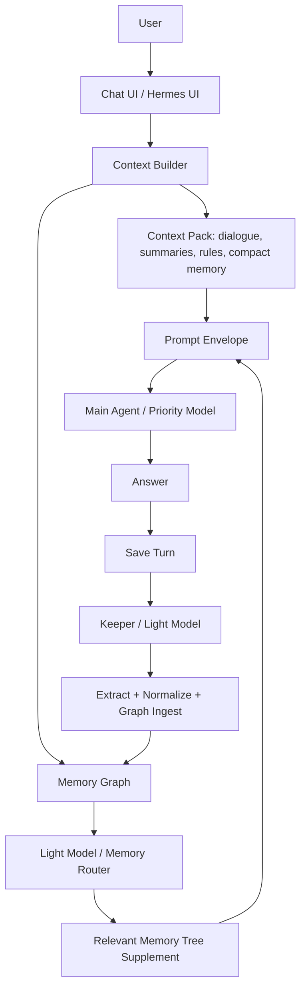

# Full Memory System - Implementation Plan

**Goal:** turn Agent Memory Kernel into an automatic cross-model memory layer where a lightweight model maintains a graph tree and injects relevant node content into the prompt before any main agent answers.
**Timeline:** 2-4 weeks for a usable local v0.2, 4-8 weeks for API/MCP, review UI, and production hardening.
**Dependencies:** Hermes hook points, one low-cost LLM provider key, SQLite migration discipline, prompt-boundary policy, and realistic conversation transcripts for tests.

---

## Findings From The Reference Material

The memory system described in the transcript has these core properties:

- Memory is external to the chat models. Switching between models keeps the same memory because the context is injected before each model call.
- The default tree separates user/person memory from interests or professional work memory.
- Users do not manually tag messages. A lightweight model checks each message and decides what belongs in the graph tree.
- The graph is not just tags. Nodes contain expanded information, provenance, and deeper branch content.
- Before a reply, a lightweight router walks the graph, finds the most relevant node or nodes, and places their expanded content into the prompt.
- After a turn, a keeper extracts topics, facts, entities, relationships, preferences, decisions, and useful context, then updates the graph tree.
- The main agent should receive a prepared prompt envelope, not spend tokens searching all historical data by itself.

## Additional Runtime Architecture Notes

The reference behavior should be implemented as one memory service with two
lightweight-model paths around the main model call:



The main agent must not scan the full graph or decide which historical branches
to inspect. That is the Router's job. The main agent receives only the selected
context package:

- system core;
- rules digest;
- user profile and addressing hints;
- compact active memory;
- older thread excerpts and summaries;
- `MEMORY_TREE_SUPPLEMENT` with expanded node content;
- recent messages;
- current user message.

The lightweight model therefore has two different responsibilities:

- **Memory Router before answer:** fetch `context_pack` and `memory_graph`, rank
  relevant branches, and assemble a `MEMORY_TREE_SUPPLEMENT`.
- **Keeper after answer:** inspect the saved exchange, extract entities,
  relationships, interests, decisions, rules, attempts, outcomes, gotchas, and
  profile facts, normalize them against existing nodes, and apply safe graph
  commands.

There is also an optional "brain/style" append path: graph-level analytics can
derive a soft style instruction, but it must be appended as a guarded system
preference and must never override user instructions, safety, or factual
accuracy.

For Hermes, this means the repository should expose a Memory Orchestrator or
Keeper service with these high-level operations:

- `record_turn` stores the complete exchange.
- `keeper_analyze_turn` turns the exchange into graph updates.
- `retrieve_context` selects relevant graph branches before the main model call.
- `build_prompt_context` returns the final prompt envelope.
- `ingest_graph` applies node, edge, summary, and evidence changes.

## Current Repository State

Already present:

- SQLite source of truth.
- Raw events, candidate memories, active memories, review actions, correction, delete, and export.
- Conversation turns, thread messages, and thread summaries.
- `memory_items`, `memory_graph_nodes`, `memory_graph_edges`, node evidence, and edge evidence.
- Keeper run and graph command audit tables.
- Deterministic rule-based extraction and graph construction.
- OpenAI-compatible lightweight extractor adapter with deterministic fallback.
- Semantic analysis slots for facts, chronology, key topics, people, events, and verified entities.
- Personal and professional lanes.
- Agent write-policy table and enforcement for record, auto-approve, review,
  lifecycle, outcome, conflict, and supersession paths.
- Memory Tree Pack and full context builder output.
- Provider-neutral prompt envelope via `before_model_call`.
- Post-turn Keeper candidate path via `after_saved_turn`.
- Queued Keeper jobs and worker processing for post-turn analysis.
- Shadow rollout traces that link Router selection and Keeper proposals with
  `write_policy=propose_only`.
- Baseline shadow trace evals for branch selection, Keeper candidate text,
  source IDs, token budget, and access mode.
- Explicit conflict and supersession records that suppress superseded memory
  from active retrieval and graph export.
- First-class outcome records and outcome packs for success/failure loop
  planning.
- Deterministic `slice seed/run/assert` vertical fixture.
- Basic prompt-injection-like quarantine.
- Hermes provider example with `context_pack`, `tree_pack`, `context_builder_pack`, `record_turn`, `remember`, graph inspection, profile, and usage methods.
- Local stdlib HTTP API service for runtime hooks and review/list operations.
- CLI and tests.

Remaining for full memory:

- Automatic pre-turn context retrieval inside each external orchestrator.
- Automatic post-turn Keeper analysis inside each external orchestrator.
- Production LLM-backed Keeper eval suite, managed model configuration, and
  reviewed extraction prompts for natural-language graph updates.
- Advanced Memory Router ranking beyond deterministic lexical/graph retrieval.
- Deeper prompt budget adapters per model provider.
- Guarded brain/style system-prompt append derived from graph analytics.
- Production Hermes runtime hooks that call memory before and after agent work.
- Production Router/Keeper eval suites built from reviewed real shadow traces.
- Production daemon mode for long-running Keeper workers.
- MCP server for agents that should not use CLI or HTTP directly.
- Provider embeddings and semantic reranking.
- Richer outcome comparison, scoring, and automatic lesson extraction.
- Human review UI or inbox.
- Hosted identity, tenancy, and capability rules beyond the local
  agent/scope/action write policy.
- Memory lifecycle propagation for correct, delete, distrust, expire, and
  conflict operations across summaries, graph nodes, and cached context packs.
- Automatic conflict detection heuristics and current-best-answer resolution.
- Broader provider adapters for the prompt envelope.
- Broader prompt-injection, source trust, and secret red-team fixtures.
- Migration, observability, and cost accounting around all LLM memory calls.

---

## Council Hardening Addendum

The architecture is directionally correct, but it is not full memory until the
following contracts are real and tested:

1. Runtime contract:
   [runtime-contract.md](runtime-contract.md) defines `before_model_call`,
   `after_saved_turn`, Router output, Keeper output, and failure behavior.
2. Memory lifecycle contract:
   [memory-lifecycle-contract.md](memory-lifecycle-contract.md) defines create,
   correct, delete, distrust, expire, conflict, export, and derived-memory
   invalidation.
3. Cross-model context contract:
   [cross-model-context-contract.md](cross-model-context-contract.md) defines
   the provider-neutral prompt envelope, token-budget adapters, and
   `MEMORY_TREE_SUPPLEMENT`.
4. Security and identity contract:
   [security-identity-contract.md](security-identity-contract.md) defines
   identity, scopes, permissions, redaction, audit, and poisoning defense.
5. End-to-end vertical slice:
   [end-to-end-vertical-slice.md](end-to-end-vertical-slice.md) defines the
   first scenario that must pass before the system can be called complete.

The biggest risk is not graph shape. The biggest risk is letting untrusted or
unauthorized memory become prompt context without provenance, correction,
deletion, redaction, and audit controls.

### Step 1: Lock The Full Memory Contract

**What we do:** Define the exact read/write contract for automatic memory: pre-turn context, post-turn ingest, graph update commands, router output, and prompt envelope output.

**Files:**

- Modify `docs/v0-memory-contract.md`.
- Modify `docs/hermes-integration.md`.
- Add/maintain `docs/runtime-contract.md`.
- Add/maintain `docs/memory-lifecycle-contract.md`.
- Add/maintain `docs/cross-model-context-contract.md`.
- Add/maintain `docs/security-identity-contract.md`.
- Add/maintain `docs/end-to-end-vertical-slice.md`.

**Commands:**

```bash
PYTHONPATH=src python3 -m unittest discover -s tests
```

**Verification:** Docs include concrete JSON examples for `before_model_call`,
`after_saved_turn`, Router result, Keeper job result, prompt envelope, lifecycle
mutations, access decisions, and poisoning/correction fixtures.

**Result:** Future agents know exactly what data enters memory, what data comes out, and where it is injected into the main agent prompt.

### Step 2: Add Automatic Memory Job Tables

**What we do:** Add durable queues and audit records for Keeper and Router runs so memory can work automatically and recover after crashes.

**Files:**

- Modify `src/agent_memory_kernel/schema.sql`.
- Modify `src/agent_memory_kernel/store.py`.
- Modify `tests/test_memory_store.py`.

**Commands:**

```bash
PYTHONPATH=src python3 -m unittest discover -s tests
PYTHONPATH=src python3 -m agent_memory_kernel.cli init --db /tmp/amk-full-memory.db
```

**Verification:** New tests prove jobs are idempotent, retryable, and linked to turn IDs, thread IDs, run IDs, and source events.

**Result:** The kernel can queue `keeper_analyze_turn`, `keeper_analyze_session`, `router_retrieve`, and `graph_optimize` work without losing provenance.

### Step 3: Build The Memory Orchestrator Module

**What we do:** Create the central service API that Hermes will call instead of manually composing separate store methods. This orchestrator owns the live turn lifecycle: pre-turn retrieval, prompt envelope construction, post-turn storage, and Keeper scheduling.

**Files:**

- Add `src/agent_memory_kernel/orchestrator.py`.
- Modify `src/agent_memory_kernel/__init__.py`.
- Modify `adapters/hermes_provider/hermes_provider.py`.
- Add tests in `tests/test_orchestrator.py`.

**Commands:**

```bash
PYTHONPATH=src python3 -m unittest discover -s tests
```

**Verification:** Tests cover `before_turn(query, thread_id, scope)`, `build_prompt_context(...)`, `record_turn(...)`, `keeper_analyze_turn(...)`, `retrieve_context(...)`, `ingest_graph(...)`, and `after_turn(user_text, assistant_text, thread_id, scope)`.

**Result:** There is one stable entrypoint for live agent memory instead of many low-level calls, and Hermes can treat memory as a service rather than as logic inside every agent.

### Step 4: Add The LLM-Backed Keeper

**What we do:** Add a low-cost model extractor that reads each turn or session and emits structured memory updates.

**Files:**

- Add `src/agent_memory_kernel/extractors/llm.py`.
- Modify `src/agent_memory_kernel/extractors/base.py`.
- Modify `src/agent_memory_kernel/store.py`.
- Add `docs/keeper-extraction.md`.
- Add tests in `tests/test_llm_keeper_contract.py`.

**Commands:**

```bash
PYTHONPATH=src python3 -m unittest discover -s tests
```

**Verification:** Contract tests validate the JSON schema without requiring a live provider. Optional integration tests run only when provider keys are present.

**Result:** The Keeper can extract user profile facts, interests, project facts, decisions, rules, attempts, outcomes, gotchas, and graph relationships from normal dialogue.

### Step 5: Implement Graph Normalization And Commands

**What we do:** Convert Keeper output into safe graph commands: create node, merge node, rename node, create edge, update summary, attach evidence, or mark conflict.

**Files:**

- Modify `src/agent_memory_kernel/store.py`.
- Add `src/agent_memory_kernel/graph_commands.py`.
- Modify `tests/test_memory_store.py`.
- Add tests in `tests/test_graph_commands.py`.

**Commands:**

```bash
PYTHONPATH=src python3 -m unittest discover -s tests
```

**Verification:** Re-running the same Keeper output does not duplicate nodes or edges. Every node and edge has evidence.

**Result:** The graph tree grows automatically while staying auditable and deduplicated.

### Step 6: Build The Memory Router

**What we do:** Add a retrieval layer that finds relevant branches for the current user request and returns expanded node content. The Router should use graph labels and tags only as routing hints; the final agent-facing output must include the underlying node summaries, blobs, evidence, and raw provenance snippets.

**Files:**

- Add `src/agent_memory_kernel/router.py`.
- Modify `src/agent_memory_kernel/store.py`.
- Modify `docs/memory-tree-pack.md`.
- Add tests in `tests/test_memory_router.py`.

**Commands:**

```bash
PYTHONPATH=src python3 -m unittest discover -s tests
```

**Verification:** Given a query, the router returns selected branches with why they were selected, node summaries, expanded blobs, related evidence, raw provenance excerpts, and a ready-to-insert `MEMORY_TREE_SUPPLEMENT`.

**Result:** Agents receive useful memory content, not just tags or labels.

### Step 7: Add Embeddings And Semantic Reranking

**What we do:** Keep lexical retrieval as the default fallback, but allow provider embeddings and optional lightweight reranking.

**Files:**

- Add `src/agent_memory_kernel/embeddings.py`.
- Modify `src/agent_memory_kernel/store.py`.
- Modify `pyproject.toml` if optional dependencies are needed.
- Add tests in `tests/test_embeddings_contract.py`.

**Commands:**

```bash
PYTHONPATH=src python3 -m unittest discover -s tests
```

**Verification:** Tests prove retrieval works without embeddings and improves branch ranking when embeddings are available.

**Result:** The router can handle paraphrases and long-running projects better than simple text search.

### Step 8: Build The Prompt Envelope

**What we do:** Produce a final agent-ready object that includes system core, rules, user profile, recent messages, summaries, memory tree supplement, guarded brain/style append, and the current user request.

**Files:**

- Add `src/agent_memory_kernel/prompt_envelope.py`.
- Modify `src/agent_memory_kernel/store.py`.
- Modify `src/agent_memory_kernel/cli.py`.
- Add `docs/prompt-envelope.md`.
- Add tests in `tests/test_prompt_envelope.py`.

**Commands:**

```bash
PYTHONPATH=src python3 -m unittest discover -s tests
PYTHONPATH=src python3 -m agent_memory_kernel.cli build-context "plan SEO work" --db /tmp/amk-full-memory.db
```

**Verification:** The output shows stable sections, token estimates, memory supplement placement, guarded brain/style placement, source IDs, and final messages ready for a main model call.

**Result:** Hermes can pass one prepared context object to any main model, so model switching preserves memory without each model owning that memory.

### Step 9: Add Hermes Before/After Hooks

**What we do:** Extend the Hermes provider from a thin demo wrapper into a practical adapter with two lifecycle hooks.

**Files:**

- Modify `adapters/hermes_provider/hermes_provider.py`.
- Modify `adapters/hermes_provider/README.md`.
- Modify `docs/hermes-integration.md`.
- Add tests in `tests/test_hermes_provider.py`.

**Commands:**

```bash
PYTHONPATH=src python3 -m unittest discover -s tests
```

**Verification:** `before_agent_turn()` returns prompt envelope data from the Router. `after_agent_turn()` records the turn and enqueues or runs Keeper analysis. The main agent never receives the full graph, only the selected memory supplement and surrounding context.

**Result:** Hermes can make every agent memory-aware without each agent implementing memory logic.

### Step 10: Add API And MCP Service Mode

**What we do:** Expose the orchestrator through HTTP and MCP so external agents can call memory without Python imports or shell commands.

**Files:**

- Add `src/agent_memory_kernel/server.py`.
- Add `src/agent_memory_kernel/mcp_server.py`.
- Modify `pyproject.toml`.
- Add `docs/api.md`.
- Add tests in `tests/test_api_contract.py`.

**Commands:**

```bash
PYTHONPATH=src python3 -m unittest discover -s tests
PYTHONPATH=src python3 -m agent_memory_kernel.server --db /tmp/amk-full-memory.db --host 127.0.0.1 --port 8765
```

**Verification:** `/before-turn`, `/after-turn`, `/review/pending`, `/graph/nodes`, and MCP equivalents return stable JSON.

**Result:** Hermes, Codex, Claude, browser agents, and local tools can share the same memory kernel.

### Step 11: Add Background Keeper Worker

**What we do:** Run queued Keeper jobs outside the user-facing response path when needed.

**Files:**

- Add `src/agent_memory_kernel/worker.py`.
- Modify `src/agent_memory_kernel/cli.py`.
- Modify `docs/hermes-integration.md`.
- Add tests in `tests/test_worker.py`.

**Commands:**

```bash
PYTHONPATH=src python3 -m unittest discover -s tests
PYTHONPATH=src python3 -m agent_memory_kernel.cli worker --db /tmp/amk-full-memory.db --once
```

**Verification:** A saved turn creates a job, the worker processes it once, writes Keeper output, and marks the job complete.

**Result:** Memory can be updated asynchronously without slowing every chat reply.

### Step 12: Add Outcome Memory For Loops

**What we do:** Make success and failure branches first-class so SEO and agent-loop projects can retrieve what worked and what failed.

**Files:**

- Modify `src/agent_memory_kernel/schema.sql`.
- Modify `src/agent_memory_kernel/store.py`.
- Modify `src/agent_memory_kernel/cli.py`.
- Modify `src/agent_memory_kernel/server.py`.
- Modify `docs/hermes-integration.md`.
- Modify `examples/agent-loop-demo/README.md`.
- Add tests in `tests/test_memory_store.py`.

**Commands:**

```bash
PYTHONPATH=src python3 -m unittest discover -s tests
```

**Verification:** A new loop plan retrieves active successful and failed
outcomes with cause, lesson, next recommendation, and linked memory provenance.

**Result:** Baseline implemented. Remaining work is richer similarity scoring,
automatic lesson extraction, and project-level comparison reports.

### Step 13: Add Review Inbox And Correction Flow

**What we do:** Make it practical for humans to approve, reject, correct, and delete memories created by the Keeper.

**Files:**

- Add `src/agent_memory_kernel/review.py`.
- Modify `src/agent_memory_kernel/cli.py`.
- Add `docs/review-workflow.md`.
- Add tests in `tests/test_review_workflow.py`.

**Commands:**

```bash
PYTHONPATH=src python3 -m unittest discover -s tests
PYTHONPATH=src python3 -m agent_memory_kernel.cli review list --db /tmp/amk-full-memory.db --status pending
```

**Verification:** Corrections update active memory, graph summaries, evidence links, and retrieval output.

**Result:** The memory tree can stay clean without requiring direct database edits.

### Step 14: Harden Prompt Boundary And Source Trust

**What we do:** Treat memory as a prompt surface and prevent untrusted content from silently becoming durable instruction.

**Files:**

- Modify `src/agent_memory_kernel/policy.py`.
- Modify `src/agent_memory_kernel/prompt_envelope.py`.
- Add `docs/security.md`.
- Add tests in `tests/test_memory_security.py`.

**Commands:**

```bash
PYTHONPATH=src python3 -m unittest discover -s tests
```

**Verification:** Untrusted external text cannot become active rules without review. Secret-like text is quarantined. Conflicting rules are flagged.

**Result:** The memory system improves agents without turning old tool output into hidden prompt injection.

### Step 15: Add Observability And Cost Accounting

**What we do:** Record model, tokens, cost, latency, selected branches, skipped branches, and prompt envelope size for every memory-related LLM call.

**Files:**

- Modify `src/agent_memory_kernel/schema.sql`.
- Modify `src/agent_memory_kernel/store.py`.
- Modify `src/agent_memory_kernel/orchestrator.py`.
- Add `docs/observability.md`.
- Add tests in `tests/test_memory_observability.py`.

**Commands:**

```bash
PYTHONPATH=src python3 -m unittest discover -s tests
```

**Verification:** Every Keeper and Router run can be audited by thread, turn, model, cost, and selected graph branches.

**Result:** Users can keep the lightweight model cheap and understand why a branch was injected into a prompt.

### Step 16: Add End-To-End Demos

**What we do:** Add realistic demos for personal memory, professional memory, cross-model context, and SEO success/failure loops.

**Files:**

- Modify `examples/personal-professional-demo/README.md`.
- Modify `examples/agent-loop-demo/README.md`.
- Add `examples/cross-model-memory-demo/README.md`.
- Add `examples/seo-loop-memory-demo/README.md`.

**Commands:**

```bash
PYTHONPATH=src python3 -m unittest discover -s tests
PYTHONPATH=src python3 -m agent_memory_kernel.cli init --db /tmp/amk-demo.db
```

**Verification:** A new user can run the examples and see that memory persists across simulated model switches.

**Result:** The repository demonstrates the full idea clearly without relying on private Hermes data.

---

## Acceptance Criteria

The repository has full memory when all of these are true:

- Every chat turn can be recorded automatically.
- A lightweight Keeper can update the graph tree without manual tags.
- A lightweight Router can select relevant branches before the main model answers.
- The prompt envelope includes expanded node content, not only branch labels.
- The same memory context can be passed to different main models.
- The main agent never has to search the whole graph by itself.
- Graph-derived style or brain hints are guarded, optional, and subordinate to
  user instructions and correctness.
- Personal and professional lanes work by default.
- Success/failure loop memory is available as an optional extension.
- Humans can review, correct, reject, delete, and export memory.
- All active memory has provenance.
- Untrusted content cannot silently become durable instructions.
- Identity, scope, permissions, and audit are present on every read/write path.
- Corrected, deleted, distrusted, expired, or conflicted memory cannot keep
  leaking through summaries, graph nodes, embeddings, or cached context packs.
- Prompt-boundary tests prove memory context remains subordinate to higher
  instructions and is not provider-specific.
- A vertical slice proves the whole loop from saved turn to Keeper update to
  Router injection to next answer.
- Memory-related model calls are auditable by cost, token use, source turn, and selected graph branches.
