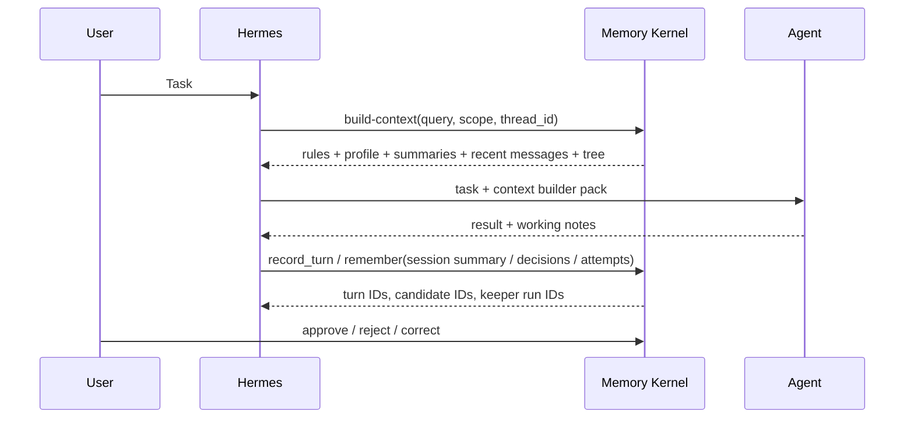

# Hermes Integration

This project is designed so Hermes can use memory without owning memory.

Hermes should stay the orchestration layer. Agent Memory Kernel should be the
memory substrate.

## Recommended Flow



## Full Memory Runtime Hooks

For full automatic memory, Hermes should treat the kernel as a runtime memory
service:

```text
user task
  -> Hermes before_model_call
  -> Memory Router builds prompt envelope with MEMORY_TREE_SUPPLEMENT
  -> main agent/model answers without graph access
  -> Hermes saves the exchange
  -> Hermes after_saved_turn
  -> Keeper extracts candidate graph updates
  -> review/policy promotes safe memory
```

Before enabling this as live memory, Hermes should run the same loop in shadow
mode. Shadow mode records the Router selection and Keeper proposal as one trace
with `write_policy=propose_only`; no candidate is auto-approved.

The concrete contracts live in:

- [runtime-contract.md](runtime-contract.md)
- [memory-lifecycle-contract.md](memory-lifecycle-contract.md)
- [cross-model-context-contract.md](cross-model-context-contract.md)
- [security-identity-contract.md](security-identity-contract.md)
- [end-to-end-vertical-slice.md](end-to-end-vertical-slice.md)
- [memory-contract.md](memory-contract.md)

Hermes should call these hooks through an adapter or service. The main agent
should receive a selected prompt envelope, not direct graph traversal rights.

## Adapter Boundary

A Hermes adapter should be thin.

Suggested interface:

```python
class HermesMemoryProvider:
    def before_model_call(self, query: str, thread_id: str = "default", scope: str = "professional") -> dict:
        ...

    def after_saved_turn(self, thread_id: str = "default", user_text: str = "", assistant_text: str = "") -> dict:
        ...

    def context_pack(self, query: str, scope: str | None = None, limit: int = 8) -> str:
        ...

    def tree_pack(self, query: str, scope: str | None = None, limit: int = 8) -> str:
        ...

    def context_builder_pack(self, query: str, scope: str | None = None, thread_id: str = "default") -> str:
        ...

    def record_turn(self, content: str, thread_id: str = "default", remember: bool = False) -> dict:
        ...

    def graph_nodes(self, scope: str | None = None, node_type: str | None = None) -> list[dict]:
        ...

    def export_profile(self, scope: str | None = None, project: str = "") -> dict:
        ...

    def remember(self, text: str, scope: str = "professional", source_ref: str = "") -> dict:
        ...

    def set_write_policy(self, agent_id: str, scope: str, action: str, decision: str) -> dict:
        ...

    def write_policies(self, agent_id: str | None = None, scope: str | None = None) -> list[dict]:
        ...

    def review_pending(self) -> list[dict]:
        ...
```

The provider should call `MemoryStore`, not duplicate storage logic.

The runtime hook pair is the preferred full-memory path. The older
`context_pack`, `tree_pack`, and `record_turn` methods remain useful as smaller
building blocks.

Hermes can call the same hooks through the local HTTP service:

```bash
agent-memory serve --db .memory/hermes-memory.db --host 127.0.0.1 --port 8765
```

Useful endpoints:

- `GET /health`
- `POST /contract`
- `POST /contract/assert`
- `POST /before-model-call`
- `POST /after-saved-turn`
- `POST /shadow-turn`
- `POST /shadow-traces`
- `POST /shadow-eval`
- `POST /shadow-evals`
- `POST /remember`
- `POST /write-policy/set`
- `POST /write-policy/list`
- `POST /search`
- `POST /review/list`
- `POST /conflict/record`
- `POST /conflict/list`
- `POST /memory/revisions`
- `POST /memory/rollback`
- `POST /supersede`
- `POST /outcome/record`
- `POST /outcome/list`
- `POST /outcome/pack`
- `POST /slice/seed`, `/slice/run`, `/slice/assert`
- `POST /acceptance/seed`, `/acceptance/run`, `/acceptance/assert`
- `POST /worker/run`

Before enabling live memory in Hermes, run the deterministic gate:

```bash
agent-memory acceptance seed --db .memory/hermes-memory.db
agent-memory acceptance assert --db .memory/hermes-memory.db
```

Passing this gate does not mean production memory is complete, but failing it
means the runtime loop is not safe enough for live pre-turn prompt injection.

## Where To Hook It

### Before Planning

When Hermes receives a task, it should generate a compact retrieval query:

- user goal;
- project name;
- relevant domain terms;
- agent role;
- requested loop type, if any.

Then call:

```bash
agent-memory before-model-call "planning SEO content refresh loop" \
  --scope professional \
  --allowed-scopes professional \
  --thread-id seo-demo \
  --agent-id writer \
  --model-id gpt-4.1-mini
```

The response includes `prompt_envelope`, `router_run_id`,
`selected_branch_ids`, `access_decisions`, and warnings.
If the active scope is not allowed, the Router returns a no-memory envelope and
records a denied access decision.

Lower-level context builder call:

```bash
agent-memory build-context "planning SEO content refresh loop" --scope professional --thread-id seo-demo
```

For a narrower tree-only prompt:

```bash
agent-memory tree-pack "planning SEO content refresh loop" --scope professional
```

The agent receives only the selected tree, not the whole memory store. Branch
labels and tags help orientation, but the actual grounding comes from active
memories and raw provenance excerpts.

For small tasks, Hermes can still call:

```bash
agent-memory context-pack "planning SEO content refresh loop" --scope professional
```

Use `context-pack` as the short form and `tree-pack` as the planning form.
Use `build-context` when the task needs rules, profile, thread summary, recent
messages, and the Memory Tree supplement together.

### Shadow Rollout

For first Hermes integration, prefer shadow mode:

```bash
agent-memory shadow-turn "planning SEO content refresh loop" \
  --scope professional \
  --thread-id seo-demo \
  --agent-id writer \
  --model-id gpt-4.1-mini \
  --user-text "Plan the next SEO content refresh loop." \
  --assistant-text "I will reuse the prior successful refresh pattern."
```

This does both sides of the runtime loop in propose-only mode:

- calls Router and records a `router_run_id`;
- saves the exchange;
- runs or queues Keeper with `auto_approve=false`;
- records `shadow_trace_id`, selected branches, candidate IDs, warnings, and
  token metadata.

Review traces with:

```bash
agent-memory shadow-traces --thread-id seo-demo
```

Turn reviewed traces into repeatable evals:

```bash
agent-memory shadow-eval trace_xxxxxxxxxxxxxxxx \
  --expected-json '{
    "expected_branch_labels": ["demo-site"],
    "expected_candidate_text": ["successful refresh pattern"],
    "forbidden_branch_labels": ["personal"],
    "max_token_estimate": 4000,
    "require_candidates": true,
    "require_memory_allowed": true
  }'
```

The first production gate should be manual review of real shadow traces:
selected branch quality, missed memory, stale memory, candidate quality,
leakage, and overlong prompt context. Each accepted review should become a
stored `shadow-eval` fixture so later Router/Keeper changes can be regression
checked.

### During Work

Hermes should record raw conversation turns:

```bash
agent-memory turn "User asked to plan the next demo-site SEO loop." \
  --thread-id seo-demo \
  --scope professional
```

Hermes can also record notable events:

- user constraints;
- decisions;
- failed tool calls;
- successful patterns;
- project-specific rules;
- final summaries.

These should enter as candidate memories unless a trusted policy explicitly
auto-approves them.

For iterative SEO or agent loops, Hermes should also record structured outcomes:

```bash
agent-memory outcome record \
  --project demo-site \
  --status failure \
  --action "Published thin pages without internal links." \
  --result "Rankings did not improve." \
  --cause "Pages lacked supporting internal links." \
  --lesson "Do not publish thin pages without internal links." \
  --next-recommendation "Add internal links before publishing." \
  --approve
```

Before planning the next loop:

```bash
agent-memory outcome pack --project demo-site
```

The outcome pack gives the planner compact success/failure history without
making it scan the entire graph.

When a turn should become durable memory immediately:

```bash
agent-memory turn "Decision: project demo-site uses graph tree retrieval before planning." \
  --thread-id seo-demo \
  --scope professional \
  --remember \
  --approve
```

That write path creates:

```text
event -> candidate -> active memory -> memory_item
      -> Keeper run -> graph nodes / graph edges -> evidence
```

### After Work

After the main agent response is saved, Hermes should call:

```bash
agent-memory after-saved-turn \
  --scope professional \
  --thread-id seo-demo \
  --agent-id writer \
  --model-id gpt-4.1-mini \
  --keeper-mode queued \
  --user-text "Plan the next SEO content refresh loop." \
  --assistant-text "I will reuse the prior successful refresh pattern."
```

This records the exchange and either creates Keeper candidates immediately
(`--keeper-mode sync`) or queues a Keeper job (`--keeper-mode queued`). Queued
jobs can be processed with:

```bash
agent-memory worker --db .memory/hermes-memory.db --once --limit 10
```

Candidates stay pending unless policy explicitly allows auto-approval.

A reviewer can approve durable memories:

```bash
agent-memory review list --status pending
agent-memory review approve cand_xxxxxxxxxxxxxxxx
```

When newer memory contradicts older memory, preserve the truth-maintenance
trail instead of leaving both as equal active facts:

```bash
agent-memory conflict record mem_old mem_new --reason "project rule changed"
agent-memory supersede mem_old mem_new --reason "newer user-stated rule wins"
agent-memory conflict list --status resolved
```

Hermes should use `conflict record` when a contradiction needs review and
`supersede` only when the winning memory is explicit enough to suppress the old
memory from retrieval.

This keeps memory quality high and makes the system auditable.

Graph audit commands:

```bash
agent-memory graph nodes --scope professional
agent-memory graph edges --scope professional
agent-memory graph groups --scope professional
agent-memory graph analyses --scope professional
agent-memory graph keeper-runs
```

Graph maintenance:

```bash
agent-memory graph optimize --mode record_linkage --scope professional
agent-memory graph optimize --mode knowledge_consistency --scope professional
agent-memory graph optimize --mode interests_reconnect --scope professional
agent-memory graph optimize --mode brain_calibration --scope professional
```

Hermes should also record LLM usage when a model call completes:

```bash
agent-memory usage record \
  --model gpt-4.1-mini \
  --thread-id seo-demo \
  --prompt-tokens 1200 \
  --completion-tokens 300
```

Workspace profile export:

```bash
agent-memory export-profile --scope professional --project demo-site
agent-memory import-profile exported-profile.json --db .memory/restored.db
```

## Loop Memory Extension

For iterative workflows, add a domain-specific schema on top of v0 memory:

```text
attempt
  -> has_input
  -> used_tool
  -> produced_outcome
  -> failed_because
  -> succeeded_because
  -> created_lesson
```

This lets future agents ask:

- What worked for similar tasks?
- What failed before?
- What should we avoid repeating?
- Which rules were derived from measured outcomes?

The v0 kernel already supports the storage primitives: conversation turns,
thread messages, thread summaries, events, candidates, active memories,
memory items, graph nodes, graph edges, node/edge evidence, source links,
Keeper audit, and audit log.

Before planning a loop, Hermes should retrieve both success and failure memory
branches when they exist. The agent can then compare:

- similar successful attempts;
- similar failed attempts;
- reusable rules derived from outcomes;
- gotchas that should not be repeated.

## Non-Goals For v0

The first Hermes adapter should not implement:

- global autonomous memory rewriting;
- opaque summarization without citations;
- direct writes from untrusted tool output into active memory;
- a huge graph ontology before real usage proves it is needed.

Start narrow: build-context before planning, candidate writes after work, manual
review for durable rules.
