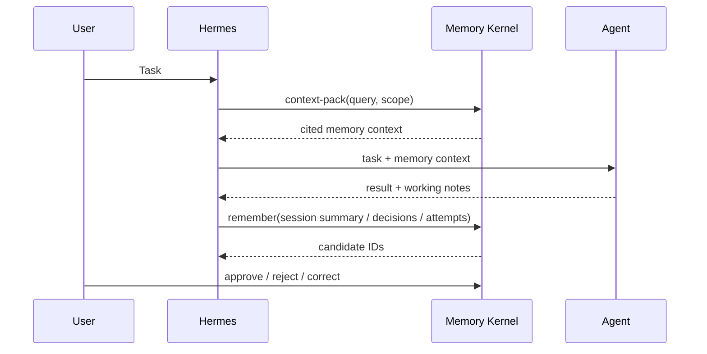

# Hermes Integration

This project is designed so Hermes can use memory without owning memory.

Hermes should stay the orchestration layer. Agent Memory Kernel should be the
memory substrate.

## Recommended Flow



## Adapter Boundary

A Hermes adapter should be thin.

Suggested interface:

```python
class HermesMemoryProvider:
    def context_pack(self, query: str, scope: str | None = None, limit: int = 8) -> str:
        ...

    def remember(self, text: str, scope: str = "professional", source_ref: str = "") -> dict:
        ...

    def review_pending(self) -> list[dict]:
        ...
```

The provider should call `MemoryStore`, not duplicate storage logic.

## Where To Hook It

### Before Planning

When Hermes receives a task, it should generate a compact retrieval query:

- user goal;
- project name;
- relevant domain terms;
- agent role;
- requested loop type, if any.

Then call:

```bash
agent-memory context-pack "planning SEO content refresh loop" --scope professional
```

The agent receives only the selected context pack, not the whole memory store.

### During Work

Hermes can record notable events:

- user constraints;
- decisions;
- failed tool calls;
- successful patterns;
- project-specific rules;
- final summaries.

These should enter as candidate memories unless a trusted policy explicitly
auto-approves them.

### After Work

A reviewer can approve durable memories:

```bash
agent-memory review list --status pending
agent-memory review approve cand_xxxxxxxxxxxxxxxx
```

This keeps memory quality high and makes the system auditable.

## Loop Memory Extension

For iterative workflows, add a domain-specific schema on top of v0 memory:

```text
attempt
  -> has_input
  -> used_tool
  -> produced_outcome
  -> failed_because
  -> succeeded_because
  -> created_lesson
```

This lets future agents ask:

- What worked for similar tasks?
- What failed before?
- What should we avoid repeating?
- Which rules were derived from measured outcomes?

The v0 kernel already supports the storage primitives: events, candidates,
active memories, graph nodes, graph edges, source links, and audit log.

## Non-Goals For v0

The first Hermes adapter should not implement:

- global autonomous memory rewriting;
- opaque summarization without citations;
- direct writes from untrusted tool output into active memory;
- a huge graph ontology before real usage proves it is needed.

Start narrow: context pack before planning, candidate writes after work, manual
review for durable rules.
