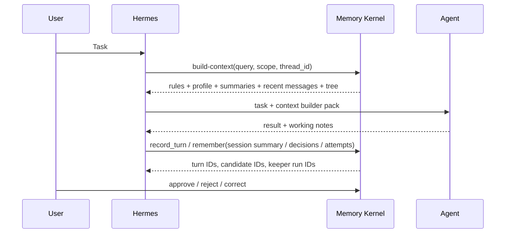

# Hermes Integration

This project is designed so Hermes can use memory without owning memory.

Hermes should stay the orchestration layer. Agent Memory Kernel should be the
memory substrate.

## Recommended Flow



## Full Memory Runtime Hooks

For full automatic memory, Hermes should treat the kernel as a runtime memory
service:

```text
user task
  -> Hermes before_model_call
  -> Memory Router builds prompt envelope with MEMORY_TREE_SUPPLEMENT
  -> main agent/model answers without graph access
  -> Hermes saves the exchange
  -> Hermes after_saved_turn
  -> Keeper extracts candidate graph updates
  -> review/policy promotes safe memory
```

Before enabling this as live memory, Hermes should run the same loop in shadow
mode. Shadow mode records the Router selection and Keeper proposal as one trace
with `write_policy=propose_only`; no candidate is auto-approved.

The concrete contracts live in:

- [runtime-contract.md](runtime-contract.md)
- [memory-lifecycle-contract.md](memory-lifecycle-contract.md)
- [cross-model-context-contract.md](cross-model-context-contract.md)
- [security-identity-contract.md](security-identity-contract.md)
- [end-to-end-vertical-slice.md](end-to-end-vertical-slice.md)
- [memory-contract.md](memory-contract.md)

Hermes should call these hooks through an adapter or service. The main agent
should receive a selected prompt envelope, not direct graph traversal rights.

## Adapter Boundary

A Hermes adapter should be thin.

Suggested interface:

```python
class HermesMemoryProvider:
    def before_agent_turn(self, query: str, thread_id: str = "default", scope: str = "professional") -> dict:
        ...

    def after_agent_turn(self, thread_id: str = "default", user_text: str = "", assistant_text: str = "") -> dict:
        ...

    def before_model_call(self, query: str, thread_id: str = "default", scope: str = "professional") -> dict:
        ...

    def after_saved_turn(self, thread_id: str = "default", user_text: str = "", assistant_text: str = "") -> dict:
        ...

    def context_pack(self, query: str, scope: str | None = None, limit: int = 8) -> str:
        ...

    def tree_pack(self, query: str, scope: str | None = None, limit: int = 8) -> str:
        ...

    def context_builder_pack(self, query: str, scope: str | None = None, thread_id: str = "default") -> str:
        ...

    def retrieve_context(self, query: str, scope: str | None = None, limit: int = 8) -> dict:
        ...

    def build_prompt_context(self, query: str, thread_id: str = "default", scope: str = "professional") -> dict:
        ...

    def record_turn(self, content: str, thread_id: str = "default", remember: bool = False) -> dict:
        ...

    def keeper_analyze_turn(self, **kwargs) -> dict:
        ...

    def ingest_graph(self, updates: list[dict], **kwargs) -> dict:
        ...

    def review_inbox(self, status: str = "open", scope: str | None = None, limit: int = 50) -> dict:
        ...

    def notifications(self, status: str = "open", scope: str | None = None, topic: str | None = None, assigned_to: str | None = None, sla_status: str | None = None) -> dict:
        ...

    def notification_escalations(self, scope: str | None = None, assigned_to: str | None = None, include_acknowledged: bool = True) -> dict:
        ...

    def assign_notification(self, notification_id: str, assigned_to: str, actor: str = "reviewer", due_at: str = "", reason: str = "") -> dict:
        ...

    def ack_notification(self, notification_id: str, actor: str = "reviewer", reason: str = "") -> dict:
        ...

    def resolve_notification(self, notification_id: str, actor: str = "reviewer", reason: str = "") -> dict:
        ...

    def review_batch(self, action: str, candidate_ids: list[str], actor: str = "reviewer", reason: str = "") -> dict:
        ...

    def approve_candidate(self, candidate_id: str, actor: str = "reviewer", reason: str = "") -> dict:
        ...

    def reject_candidate(self, candidate_id: str, actor: str = "reviewer", reason: str = "") -> dict:
        ...

    def correct_memory(self, memory_id: str, text: str, actor: str = "reviewer", reason: str = "") -> dict:
        ...

    def batch_memory_lifecycle(self, operations: list[dict], actor: str = "reviewer", reason: str = "", dry_run: bool = False) -> dict:
        ...

    def delete_memory(self, memory_id: str, actor: str = "reviewer", reason: str = "") -> dict:
        ...

    def distrust_memory(self, memory_id: str, actor: str = "reviewer", reason: str = "") -> dict:
        ...

    def expire_memory(self, memory_id: str, actor: str = "reviewer", reason: str = "") -> dict:
        ...

    def graph_nodes(self, scope: str | None = None, node_type: str | None = None) -> list[dict]:
        ...

    def graph_browser(self, scope: str | None = None, node_type: str | None = None, query: str = "", limit: int = 50) -> dict:
        ...

    def export_profile(
        self,
        scope: str | None = None,
        project: str = "",
        actor: str = "hermes",
        redaction_profile: str = "full",
        approval_id: str = "",
        retention_days: int | None = None,
    ) -> dict:
        ...

    def export_encrypted_profile(self, **kwargs) -> dict:
        ...

    def decrypt_encrypted_export(self, envelope: dict, **kwargs) -> dict:
        ...

    def import_encrypted_profile(self, envelope: dict, **kwargs) -> dict:
        ...

    def export_control_report(
        self,
        actor: str = "hermes",
        scope: str | None = None,
        project: str = "",
        redaction_profile: str = "full",
        approval_id: str = "",
        retention_days: int | None = None,
    ) -> dict:
        ...

    def request_export_approval(self, **kwargs) -> dict:
        ...

    def export_approvals(self, **kwargs) -> list[dict]:
        ...

    def approve_export_approval(self, approval_id: str, **kwargs) -> dict:
        ...

    def reject_export_approval(self, approval_id: str, **kwargs) -> dict:
        ...

    def export_retention_records(self, **kwargs) -> list[dict]:
        ...

    def enforce_export_retention(self, **kwargs) -> dict:
        ...

    def purge_export_record(self, export_id: str, **kwargs) -> dict:
        ...

    def remember(self, text: str, scope: str = "professional", source_ref: str = "") -> dict:
        ...

    def set_write_policy(self, agent_id: str, scope: str, action: str, decision: str) -> dict:
        ...

    def write_policies(self, agent_id: str | None = None, scope: str | None = None) -> list[dict]:
        ...

    def review_pending(self) -> list[dict]:
        ...

    def current_best_report(self, query: str = "", scope: str | None = None) -> dict:
        ...

    def memory_changes(self, keeper_job_id: str = "", thread_id: str | None = None) -> dict:
        ...

    def capability_report(self, actor: str = "hermes", scope: str = "professional") -> dict:
        ...

    def derived_invalidations(self, memory_id: str = "", scope: str | None = None) -> dict:
        ...

    def operational_status(self) -> dict:
        ...

    def observability_report(self, scope: str | None = None, thread_id: str | None = None) -> dict:
        ...

    def migration_status(self) -> dict:
        ...

    def backup_database(self, out_path: str) -> dict:
        ...

    def restore_database(self, backup_path: str, target_path: str) -> dict:
        ...
```

The provider should call `MemoryOrchestrator`/`MemoryStore`, not duplicate
storage logic.

The runtime hook pair is the preferred full-memory path. The older
`context_pack`, `tree_pack`, and `record_turn` methods remain useful as smaller
building blocks.

Hermes can call the same hooks through the local HTTP service:

```bash
agent-memory serve --db .memory/hermes-memory.db --host 127.0.0.1 --port 8765
```

The same stdlib server exposes browser operator pages at
`http://127.0.0.1:8765/ui/review` and `http://127.0.0.1:8765/ui/graph`.
The review page can approve/reject individual or selected candidates, preview
batch decisions, and preview/apply active-memory corrections.

For agents that speak MCP, run the stdio server instead of HTTP:

```bash
agent-memory mcp --db .memory/hermes-memory.db
# or
agent-memory-mcp --db .memory/hermes-memory.db
```

The MCP tools mirror the runtime API: `memory_before_model_call`,
`memory_before_turn`, `memory_build_prompt_context`, `memory_after_saved_turn`,
`memory_after_turn`, `memory_retrieve_context`, `memory_ingest_graph`,
`memory_changes`, `memory_tree_pack`, `memory_capability_check`,
`memory_derived_invalidations`, `memory_operational_status`,
`memory_observability`, `memory_migration_status`, `memory_backup_database`,
`memory_restore_database`, `memory_review_list`, `memory_graph_nodes`,
`memory_graph_edges`, `memory_graph_browser`, `memory_export_control`, `memory_export_profile`,
`memory_export_encrypted_profile`, `memory_import_encrypted_profile`, and
`memory_notifications_list`, `memory_notification_assign`,
`memory_notification_ack`, `memory_notification_resolve`,
`memory_notification_escalations`,
`memory_lifecycle_batch`, and
`memory_export_approval_request`, `memory_export_approval_list`,
`memory_export_approval_approve`, `memory_export_approval_reject`, and
`memory_export_retention_list`, `memory_export_retention_enforce`,
`memory_export_retention_purge`, and `memory_worker_run`.

Useful endpoints:

- `GET /health`
- `POST /contract`
- `POST /contract/assert`
- `POST /operational/status`
- `POST /migration/status`
- `POST /backup`
- `POST /restore`
- `POST /conformance/spec`
- `POST /conformance/spec/assert`
- `POST /before-turn`
- `POST /build-prompt-context`
- `POST /retrieve-context`
- `POST /record-turn`
- `POST /keeper-analyze-turn`
- `POST /after-turn`
- `POST /ingest-graph`
- `POST /before-model-call`
- `POST /after-saved-turn`
- `POST /shadow-turn`
- `POST /shadow-traces`
- `POST /shadow-eval`
- `POST /shadow-evals`
- `POST /read-time-policy`
- `POST /router-runs`
- `POST /router-explain`
- `POST /router-feedback/record`
- `POST /router-feedback/list`
- `POST /memory-quality`
- `POST /observability`
- `POST /current-best`
- `POST /memory-changes`
- `POST /memory/lifecycle-batch`
- `POST /graph/browser`
- `POST /notifications/list`
- `POST /notifications/escalations`
- `POST /notifications/assign`
- `POST /notifications/ack`
- `POST /notifications/resolve`
- `POST /derived-invalidations`
- `POST /remember`
- `POST /graph/items`
- `POST /graph/nodes`
- `POST /graph/edges`
- `POST /write-policy/set`
- `POST /write-policy/list`
- `POST /read-policy/set`
- `POST /read-policy/list`
- `POST /capability/check`
- `POST /export/control`
- `POST /export/profile`
- `POST /export/encrypted-profile`
- `POST /import/encrypted-profile`
- `POST /export/approval/request`
- `POST /export/approval/list`
- `POST /export/approval/approve`
- `POST /export/approval/reject`
- `POST /export/retention/list`
- `POST /export/retention/enforce`
- `POST /export/retention/purge`
- `POST /search`
- `POST /review/inbox`
- `POST /review/batch`
- `POST /review/list`
- `POST /review/approve`
- `POST /review/reject`
- `POST /memory/correct`
- `POST /memory/delete`
- `POST /memory/distrust`
- `POST /memory/expire`
- `POST /brain/style`
- `POST /conflict/record`
- `POST /conflict/list`
- `POST /memory/revisions`
- `POST /memory/rollback`
- `POST /supersede`
- `POST /outcome/record`
- `POST /outcome/list`
- `POST /outcome/pack`
- `POST /slice/seed`, `/slice/run`, `/slice/assert`
- `POST /acceptance/seed`, `/acceptance/run`, `/acceptance/assert`
- `POST /conformance/seed`, `/conformance/run`, `/conformance/assert`
- `POST /worker/run`

Before enabling live memory in Hermes, run the deterministic gate:

```bash
agent-memory acceptance seed --db .memory/hermes-memory.db
agent-memory acceptance assert --db .memory/hermes-memory.db
```

Passing this gate does not mean production memory is complete, but failing it
means the runtime loop is not safe enough for live pre-turn prompt injection.

For adapter compatibility, run the public conformance suite as well:

```bash
agent-memory conformance spec
agent-memory conformance seed --db .memory/hermes-memory.db
agent-memory conformance assert --db .memory/hermes-memory.db
```

This suite names the behavior Hermes must preserve: selected professional
memory enters the prompt with provenance, personal memory stays out of
professional prompts, stored read policies can deny injection, resolved conflict
losers are suppressed, deleted and unsafe memory stay absent, and Keeper writes
remain reviewable and retry-safe by default.

## Where To Hook It

### Before Planning

When Hermes receives a task, it should generate a compact retrieval query:

- user goal;
- project name;
- relevant domain terms;
- agent role;
- requested loop type, if any.

Then call:

```bash
agent-memory before-model-call "planning SEO content refresh loop" \
  --scope professional \
  --allowed-scopes professional \
  --thread-id seo-demo \
  --agent-id writer \
  --model-id gpt-4.1-mini
```

The response includes `prompt_envelope`, `router_run_id`,
`selected_branch_ids`, `access_decisions`, and warnings.
If the active scope is not allowed, the Router returns a no-memory envelope and
records a denied access decision.
The prompt envelope metadata includes `read_time_policy`,
`selection_decisions`, `current_best`, and `truncated_branch_count`, so Hermes
can audit why a memory branch entered the prompt and which resolved conflicts
suppressed stale loser memories.
When graph-level Digital Brain state has enough classified nodes and a clear
skew, `prompt_envelope.system` also includes a guarded advisory style append.
The decision is visible in `prompt_envelope.metadata.brain_style`, and no style
append is emitted when memory access is denied or Hermes disables graph-derived
style for that call:

```bash
agent-memory before-model-call "planning SEO content refresh loop" \
  --scope professional \
  --allowed-scopes professional \
  --disable-brain-style
```

To explain a live Router decision:

```bash
agent-memory router-runs --thread-id seo-demo
agent-memory router-explain router_xxxxxxxxxxxxxxxx
```

After the task, Hermes or a reviewer can record whether the selected memory was
actually useful:

```bash
agent-memory router-feedback record router_xxxxxxxxxxxxxxxx \
  --memory-id mem_xxxxxxxxxxxxxxxx \
  --rating helpful \
  --reason "the selected branch grounded the SEO loop plan"

agent-memory memory-quality --scope professional
agent-memory current-best --scope professional "planning SEO content refresh loop"
```

Feedback is a quality signal only. It does not automatically approve, delete, or
rewrite memory; later Router evals and reviewers can use it to tune ranking and
find stale or harmful branches.
`current-best` is the truth-maintenance readout: with a query it shows selected
branches plus resolved winners, suppressed losers, and unresolved conflicts; with
no query it summarizes open and resolved conflict counts.

To inspect post-turn memory writes, use the Keeper job id returned by
`after-saved-turn`:

```bash
agent-memory memory-changes --keeper-job-id kjob_xxxxxxxxxxxxxxxx
agent-memory memory-changes --thread-id seo-demo
```

The report shows saved turns, the Keeper event, candidate memories, promoted
active memories, affected graph/context surfaces, review or lifecycle handles,
and the audit trail. This is the operator-facing answer to "what changed after
that turn and why?".

For the broader operator queue, Hermes can call:

```bash
agent-memory review --db .memory/hermes-memory.db inbox --status open --scope professional
```

or MCP `memory_review_inbox`. The inbox returns candidate source previews,
risk flags, inline possible-conflict warnings against active memory, graph
previews, review history, audit trail, and CLI/HTTP/MCP handles for
approve/reject or active-memory correct/delete/distrust/expire.
Hermes can also call `notifications()` or MCP `memory_notifications_list` for a
single operator queue across pending memory review, sensitive export approval,
and export-retention cleanup. A notification can be acknowledged without
mutating memory, then resolved automatically by the underlying approve/reject or
purge action, or manually through `resolve_notification()`.
Notifications can also be assigned to a reviewer with optional `due_at`, so
Hermes can show per-operator queues before a richer hosted UI exists.
Every notification includes computed SLA metadata from `due_at`; Hermes can
filter `sla_status=overdue` or `sla_status=due_soon` for escalation queues.
Hermes can call `notification_escalations()` or MCP
`memory_notification_escalations` for a policy-only escalation report before
any push/email/web transport exists.
Hermes should show this to a human reviewer or policy service; the main agent
should not silently promote its own Keeper output.
For multiple candidates, Hermes can call `review_batch()` or MCP
`memory_review_batch` with `dry_run=true` first, then run the approve/reject
batch after the operator confirms the item-level results.
For active memories, Hermes can call `batch_memory_lifecycle()` or MCP
`memory_lifecycle_batch` with `dry_run=true` before correcting, deleting,
distrusting, or expiring several records.
For graph navigation, Hermes can call `graph_browser()` or MCP
`memory_graph_browser` to get nodes, edges, and source previews in one payload.

Lower-level context builder call:

```bash
agent-memory build-context "planning SEO content refresh loop" --scope professional --thread-id seo-demo
```

For a narrower tree-only prompt:

```bash
agent-memory tree-pack "planning SEO content refresh loop" --scope professional
```

The agent receives only the selected tree, not the whole memory store. Branch
labels and tags help orientation, but the actual grounding comes from active
memories and raw provenance excerpts.

For small tasks, Hermes can still call:

```bash
agent-memory context-pack "planning SEO content refresh loop" --scope professional
```

Use `context-pack` as the short form and `tree-pack` as the planning form.
Use `build-context` when the task needs rules, profile, thread summary, recent
messages, and the Memory Tree supplement together.

### Shadow Rollout

For first Hermes integration, prefer shadow mode:

```bash
agent-memory shadow-turn "planning SEO content refresh loop" \
  --scope professional \
  --thread-id seo-demo \
  --agent-id writer \
  --model-id gpt-4.1-mini \
  --user-text "Plan the next SEO content refresh loop." \
  --assistant-text "I will reuse the prior successful refresh pattern."
```

This does both sides of the runtime loop in propose-only mode:

- calls Router and records a `router_run_id`;
- saves the exchange;
- runs or queues Keeper with `auto_approve=false`;
- records `shadow_trace_id`, selected branches, candidate IDs, warnings, and
  token metadata.

Review traces with:

```bash
agent-memory shadow-traces --thread-id seo-demo
```

Turn reviewed traces into repeatable evals:

```bash
agent-memory shadow-eval trace_xxxxxxxxxxxxxxxx \
  --expected-json '{
    "expected_branch_labels": ["demo-site"],
    "expected_candidate_text": ["successful refresh pattern"],
    "forbidden_branch_labels": ["personal"],
    "max_token_estimate": 4000,
    "require_candidates": true,
    "require_memory_allowed": true
  }'
```

The first production gate should be manual review of real shadow traces:
selected branch quality, missed memory, stale memory, candidate quality,
leakage, and overlong prompt context. Each accepted review should become a
stored `shadow-eval` fixture so later Router/Keeper changes can be regression
checked.

### During Work

Hermes should record raw conversation turns:

```bash
agent-memory turn "User asked to plan the next demo-site SEO loop." \
  --thread-id seo-demo \
  --scope professional
```

Hermes can also record notable events:

- user constraints;
- decisions;
- failed tool calls;
- successful patterns;
- project-specific rules;
- final summaries.

These should enter as candidate memories unless a trusted policy explicitly
auto-approves them.

For iterative SEO or agent loops, Hermes should also record structured outcomes:

```bash
agent-memory outcome record \
  --project demo-site \
  --status failure \
  --action "Published thin pages without internal links." \
  --result "Rankings did not improve." \
  --cause "Pages lacked supporting internal links." \
  --lesson "Do not publish thin pages without internal links." \
  --next-recommendation "Add internal links before publishing." \
  --approve
```

Before planning the next loop:

```bash
agent-memory outcome pack --project demo-site
```

The outcome pack gives the planner compact success/failure history without
making it scan the entire graph.

When a turn should become durable memory immediately:

```bash
agent-memory turn "Decision: project demo-site uses graph tree retrieval before planning." \
  --thread-id seo-demo \
  --scope professional \
  --remember \
  --approve
```

That write path creates:

```text
event -> candidate -> active memory -> memory_item
      -> Keeper run -> graph nodes / graph edges -> evidence
```

### After Work

After the main agent response is saved, Hermes should call:

```bash
agent-memory after-saved-turn \
  --scope professional \
  --thread-id seo-demo \
  --agent-id writer \
  --model-id gpt-4.1-mini \
  --keeper-mode queued \
  --user-text "Plan the next SEO content refresh loop." \
  --assistant-text "I will reuse the prior successful refresh pattern."
```

This records the exchange and either creates Keeper candidates immediately
(`--keeper-mode sync`) or queues a Keeper job (`--keeper-mode queued`). Queued
jobs can be processed with:

```bash
agent-memory worker --db .memory/hermes-memory.db --once --limit 10
agent-memory worker --db .memory/hermes-memory.db --daemon --poll-interval 5 --limit 10
```

Candidates stay pending unless policy explicitly allows auto-approval.
Run daemon mode under systemd, launchd, or another supervisor for live Hermes
traffic; use `--max-iterations` or `--stop-when-idle` for bounded maintenance
runs.

A reviewer can approve durable memories:

```bash
agent-memory review list --status pending
agent-memory review approve cand_xxxxxxxxxxxxxxxx
```

When newer memory contradicts older memory, preserve the truth-maintenance
trail instead of leaving both as equal active facts:

```bash
agent-memory conflict record mem_old mem_new --reason "project rule changed"
agent-memory supersede mem_old mem_new --reason "newer user-stated rule wins"
agent-memory conflict list --status resolved
agent-memory current-best "project rule changed" --scope professional
```

Hermes should use `conflict record` when a contradiction needs review and
`supersede` only when the winning memory is explicit enough to suppress the old
memory from retrieval.
If a conflict is already resolved with a winner, prompt-facing tree retrieval
uses that winner and suppresses the loser even when the query matches the stale
loser text.

This keeps memory quality high and makes the system auditable.

Graph audit commands:

```bash
agent-memory graph nodes --scope professional
agent-memory graph edges --scope professional
agent-memory graph groups --scope professional
agent-memory graph analyses --scope professional
agent-memory graph keeper-runs
```

Graph maintenance:

```bash
agent-memory graph optimize --mode record_linkage --scope professional
agent-memory graph optimize --mode knowledge_consistency --scope professional
agent-memory graph optimize --mode interests_reconnect --scope professional
agent-memory graph optimize --mode brain_calibration --scope professional
```

Hermes should also record LLM usage when a model call completes:

```bash
agent-memory usage record \
  --model gpt-4.1-mini \
  --thread-id seo-demo \
  --prompt-tokens 1200 \
  --completion-tokens 300

agent-memory observability --scope professional --thread-id seo-demo
```

Before migrations or production rollout, Hermes operators should run:

```bash
agent-memory migration-status --db .memory/hermes-memory.db
agent-memory backup --db .memory/hermes-memory.db --out .memory/backups/hermes-memory.db
```

Workspace profile export:

```bash
agent-memory export-control --scope professional --project demo-site --actor writer --redaction-profile safe
agent-memory export-profile --scope professional --project demo-site --redaction-profile safe
AGENT_MEMORY_EXPORT_PASSPHRASE="change-me" agent-memory export-encrypted-profile --scope professional --project demo-site --redaction-profile safe --out exported-profile.encrypted.json
AGENT_MEMORY_EXPORT_PASSPHRASE="change-me" agent-memory import-encrypted-profile exported-profile.encrypted.json --db .memory/restored.db
agent-memory import-profile exported-profile.json --db .memory/restored.db
```

Run export control before export. It returns matched export policy, aggregate
counts by scope, sensitivity/trust breakdowns, denied scopes, and risk flags
without returning memory content.
Use `--redaction-profile safe` or `--redaction-profile metadata` when Hermes
should share memory structure without sharing content-bearing fields.
For `full` exports that include personal or secret active memory, Hermes should
call `export-approval request`, wait for operator approval, then pass
`--approval-id` to `export-profile` or markdown export. Approvals are one-time:
after a successful full export the approval status becomes `used`.
Every real export creates a retention ledger record. `--retention-days`
defaults by redaction profile, and markdown exports also write
`.agent-memory-export-manifest.json`. Hermes should call
`export-retention enforce` from maintenance to mark expired export records, then
`export-retention purge` after external artifact cleanup.
Encrypted profile export returns an authenticated `encrypted-export-v0.1`
envelope and hides the plaintext profile payload from the artifact. CLI use can
read the passphrase from `AGENT_MEMORY_EXPORT_PASSPHRASE` or
`--passphrase-file`; MCP should normally reference a passphrase environment
variable instead of sending the passphrase through the tool payload.

## Loop Memory Extension

For iterative workflows, add a domain-specific schema on top of v0 memory:

```text
attempt
  -> has_input
  -> used_tool
  -> produced_outcome
  -> failed_because
  -> succeeded_because
  -> created_lesson
```

This lets future agents ask:

- What worked for similar tasks?
- What failed before?
- What should we avoid repeating?
- Which rules were derived from measured outcomes?

The v0 kernel already supports the storage primitives: conversation turns,
thread messages, thread summaries, events, candidates, active memories,
memory items, graph nodes, graph edges, node/edge evidence, source links,
Keeper audit, and audit log.

Before planning a loop, Hermes should retrieve both success and failure memory
branches when they exist. The agent can then compare:

- similar successful attempts;
- similar failed attempts;
- reusable rules derived from outcomes;
- gotchas that should not be repeated.

## Non-Goals For v0

The first Hermes adapter should not implement:

- global autonomous memory rewriting;
- opaque summarization without citations;
- direct writes from untrusted tool output into active memory;
- a huge graph ontology before real usage proves it is needed.

Start narrow: build-context before planning, candidate writes after work, manual
review for durable rules.
