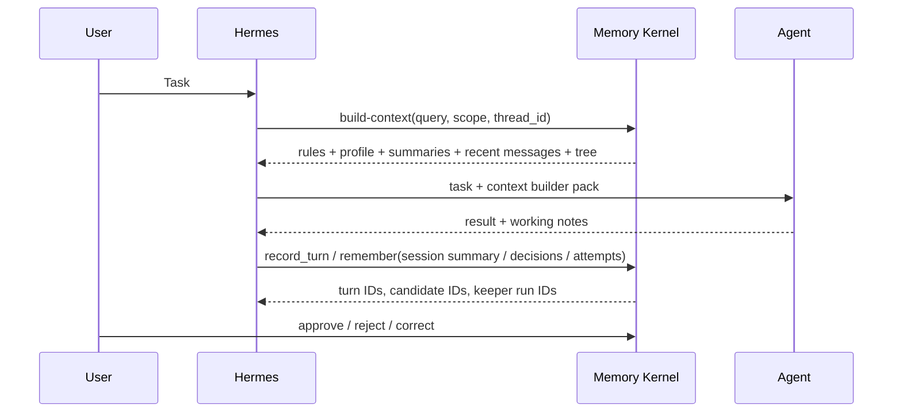

# Hermes Integration

This project is designed so Hermes can use memory without owning memory.

Hermes should stay the orchestration layer. Agent Memory Kernel should be the
memory substrate.

## Recommended Flow



## Adapter Boundary

A Hermes adapter should be thin.

Suggested interface:

```python
class HermesMemoryProvider:
    def context_pack(self, query: str, scope: str | None = None, limit: int = 8) -> str:
        ...

    def tree_pack(self, query: str, scope: str | None = None, limit: int = 8) -> str:
        ...

    def context_builder_pack(self, query: str, scope: str | None = None, thread_id: str = "default") -> str:
        ...

    def record_turn(self, content: str, thread_id: str = "default", remember: bool = False) -> dict:
        ...

    def graph_nodes(self, scope: str | None = None, node_type: str | None = None) -> list[dict]:
        ...

    def export_profile(self, scope: str | None = None, project: str = "") -> dict:
        ...

    def remember(self, text: str, scope: str = "professional", source_ref: str = "") -> dict:
        ...

    def review_pending(self) -> list[dict]:
        ...
```

The provider should call `MemoryStore`, not duplicate storage logic.

## Where To Hook It

### Before Planning

When Hermes receives a task, it should generate a compact retrieval query:

- user goal;
- project name;
- relevant domain terms;
- agent role;
- requested loop type, if any.

Then call:

```bash
agent-memory build-context "planning SEO content refresh loop" --scope professional --thread-id seo-demo
```

For a narrower tree-only prompt:

```bash
agent-memory tree-pack "planning SEO content refresh loop" --scope professional
```

The agent receives only the selected tree, not the whole memory store. Branch
labels and tags help orientation, but the actual grounding comes from active
memories and raw provenance excerpts.

For small tasks, Hermes can still call:

```bash
agent-memory context-pack "planning SEO content refresh loop" --scope professional
```

Use `context-pack` as the short form and `tree-pack` as the planning form.
Use `build-context` when the task needs rules, profile, thread summary, recent
messages, and the Memory Tree supplement together.

### During Work

Hermes should record raw conversation turns:

```bash
agent-memory turn "User asked to plan the next demo-site SEO loop." \
  --thread-id seo-demo \
  --scope professional
```

Hermes can also record notable events:

- user constraints;
- decisions;
- failed tool calls;
- successful patterns;
- project-specific rules;
- final summaries.

These should enter as candidate memories unless a trusted policy explicitly
auto-approves them.

When a turn should become durable memory immediately:

```bash
agent-memory turn "Decision: project demo-site uses graph tree retrieval before planning." \
  --thread-id seo-demo \
  --scope professional \
  --remember \
  --approve
```

That write path creates:

```text
event -> candidate -> active memory -> memory_item
      -> Keeper run -> graph nodes / graph edges -> evidence
```

### After Work

A reviewer can approve durable memories:

```bash
agent-memory review list --status pending
agent-memory review approve cand_xxxxxxxxxxxxxxxx
```

This keeps memory quality high and makes the system auditable.

Graph audit commands:

```bash
agent-memory graph nodes --scope professional
agent-memory graph edges --scope professional
agent-memory graph groups --scope professional
agent-memory graph analyses --scope professional
agent-memory graph keeper-runs
```

Graph maintenance:

```bash
agent-memory graph optimize --mode record_linkage --scope professional
agent-memory graph optimize --mode knowledge_consistency --scope professional
agent-memory graph optimize --mode interests_reconnect --scope professional
agent-memory graph optimize --mode brain_calibration --scope professional
```

Hermes should also record LLM usage when a model call completes:

```bash
agent-memory usage record \
  --model gpt-4.1-mini \
  --thread-id seo-demo \
  --prompt-tokens 1200 \
  --completion-tokens 300
```

Workspace profile export:

```bash
agent-memory export-profile --scope professional --project demo-site
agent-memory import-profile exported-profile.json --db .memory/restored.db
```

## Loop Memory Extension

For iterative workflows, add a domain-specific schema on top of v0 memory:

```text
attempt
  -> has_input
  -> used_tool
  -> produced_outcome
  -> failed_because
  -> succeeded_because
  -> created_lesson
```

This lets future agents ask:

- What worked for similar tasks?
- What failed before?
- What should we avoid repeating?
- Which rules were derived from measured outcomes?

The v0 kernel already supports the storage primitives: conversation turns,
thread messages, thread summaries, events, candidates, active memories,
memory items, graph nodes, graph edges, node/edge evidence, source links,
Keeper audit, and audit log.

Before planning a loop, Hermes should retrieve both success and failure memory
branches when they exist. The agent can then compare:

- similar successful attempts;
- similar failed attempts;
- reusable rules derived from outcomes;
- gotchas that should not be repeated.

## Non-Goals For v0

The first Hermes adapter should not implement:

- global autonomous memory rewriting;
- opaque summarization without citations;
- direct writes from untrusted tool output into active memory;
- a huge graph ontology before real usage proves it is needed.

Start narrow: build-context before planning, candidate writes after work, manual
review for durable rules.
