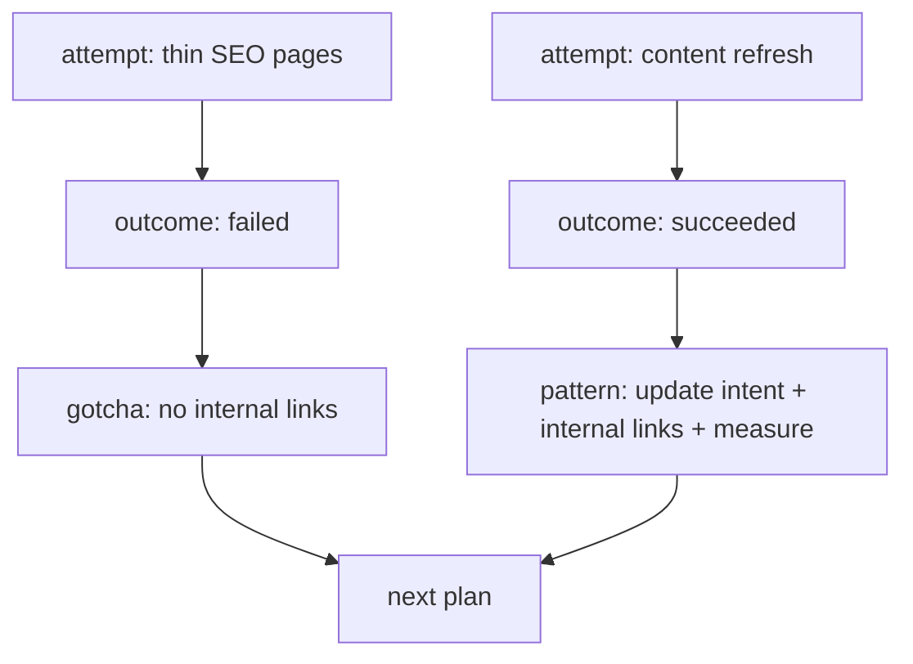

# Agent Loop Demo

This demo shows how the same kernel can support iterative project memory:
successes, failures, attempts, and reusable lessons.

The current v0 extractor is intentionally simple, so these are stored as
professional memories. A v0.2 outcome extractor can promote these into richer
`attempt`, `outcome`, `pattern`, and `gotcha` nodes.

## Run

```bash
PYTHONPATH=../../src python3 -m agent_memory_kernel.cli init --db /tmp/amk-loop.db
```

Record a failed attempt:

```bash
PYTHONPATH=../../src python3 -m agent_memory_kernel.cli remember \
  --db /tmp/amk-loop.db \
  "Failed attempt: publishing thin SEO pages without internal links did not work for project demo-site." \
  --scope professional
```

Record a successful pattern:

```bash
PYTHONPATH=../../src python3 -m agent_memory_kernel.cli remember \
  --db /tmp/amk-loop.db \
  "Rule: successful SEO refresh loops update search intent, add internal links, and track ranking changes after publishing." \
  --scope professional \
  --approve
```

Search before planning the next loop:

```bash
PYTHONPATH=../../src python3 -m agent_memory_kernel.cli context-pack \
  --db /tmp/amk-loop.db \
  "SEO refresh loop failed successful internal links"
```

## Future Extension

The outcome layer can turn the notes above into a graph:


