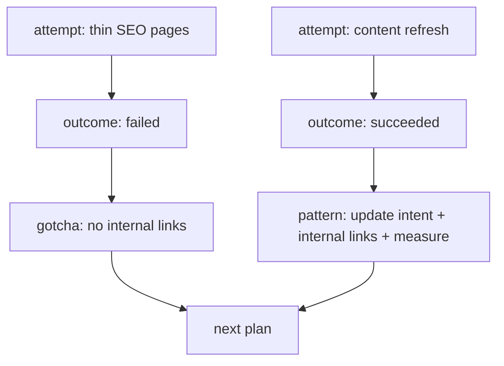

# Agent Loop Demo

This demo shows how the same kernel can support iterative project memory:
successes, failures, attempts, and reusable lessons.

Outcome records keep the loop-specific fields structured while also creating
normal reviewable memory candidates.

## Run

```bash
PYTHONPATH=../../src python3 -m agent_memory_kernel.cli init --db /tmp/amk-loop.db
```

Record a failed attempt:

```bash
PYTHONPATH=../../src python3 -m agent_memory_kernel.cli outcome \
  --db /tmp/amk-loop.db \
  record \
  --project demo-site \
  --status failure \
  --action "Published thin SEO pages without internal links." \
  --result "Rankings did not improve." \
  --cause "Pages lacked supporting internal links." \
  --lesson "Do not publish thin pages without internal links." \
  --next-recommendation "Add internal links before publishing." \
  --approve
```

Record a successful pattern:

```bash
PYTHONPATH=../../src python3 -m agent_memory_kernel.cli outcome \
  --db /tmp/amk-loop.db \
  record \
  --project demo-site \
  --status success \
  --action "Updated search intent and added internal links." \
  --result "Organic clicks improved after publishing." \
  --cause "Intent matched the page better." \
  --lesson "Refresh intent and internal links together." \
  --next-recommendation "Reuse this pattern on similar pages." \
  --approve
```

Build the outcome pack before planning the next loop:

```bash
PYTHONPATH=../../src python3 -m agent_memory_kernel.cli outcome \
  --db /tmp/amk-loop.db \
  pack \
  --project demo-site
```
The outcome pack gives the planner both what worked and what failed:


